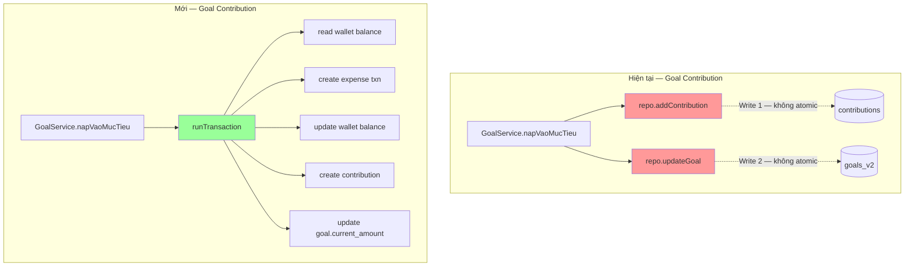
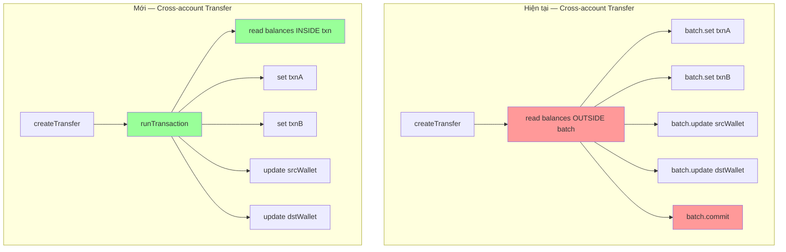

# Tài liệu Thiết kế — Sửa lỗi thiết kế Firestore

## Tổng quan

Tài liệu này mô tả thiết kế chi tiết để sửa 13 vấn đề thiết kế Firestore trong ứng dụng vintage_ledger. Các thay đổi được chia thành 4 nhóm:

1. **Atomic operations** (Issues #1, #2, #3, #10): Chuyển các thao tác ghi rời rạc sang `runTransaction` hoặc `WriteBatch` để đảm bảo tính nhất quán dữ liệu.
2. **Loại bỏ dữ liệu dư thừa** (Issue #4): Xóa `transfers_v2` collection và consolidate vào `transactions`.
3. **Security rules** (Issues #5, #6, #7, #12, #13): Sửa validate sai field, thêm validate thiếu, khóa legacy collections.
4. **Indexes** (Issues #8, #9): Thêm index thiếu, xóa index dư.

## Kiến trúc

### Luồng dữ liệu hiện tại vs. mới





### Phạm vi thay đổi

| File | Issues |
|------|--------|
| `lib/features/goal/services/goal_service.dart` | #1 |
| `lib/features/goal/repositories/goal_repository.dart` | #1 |
| `lib/features/debt/services/debt_service.dart` | #2 |
| `lib/features/debt/repositories/debt_repository.dart` | #2 |
| `lib/features/transaction/services/transaction_service.dart` | #3 |
| `lib/features/transfer/services/transfer_service.dart` | #4 |
| `lib/features/transfer/repositories/transfer_repository.dart` | #4 |
| `lib/features/account/services/account_service.dart` | #10, #11 |
| `firestore.rules` | #5, #6, #7, #12, #13 |
| `firestore.indexes.json` | #8, #9 |

## Components và Interfaces

### Issue #1: GoalService — Atomic Goal Contribution

**Thay đổi `GoalService.napVaoMucTieu()`:**

Hiện tại method nhận `goalId` và `amount`. Cần thêm `walletId` parameter (hoặc lấy từ `goal.fundingWalletId`).

```dart
// GoalService — napVaoMucTieu (mới)
Future<void> napVaoMucTieu(String goalId, int amount, {String? note}) async {
  final firestore = FirebaseFirestore.instance;
  final accountId = sl.appState.currentAccountId;
  final userId = sl.appState.currentUserId ?? '';
  final now = DateTime.now();

  await firestore.runTransaction((txn) async {
    // 1. Read goal
    final goalRef = firestore.collection('accounts').doc(accountId)
        .collection('goals_v2').doc(goalId);
    final goalSnap = await txn.get(goalRef);
    if (!goalSnap.exists) throw Exception('Goal not found');
    final goalData = goalSnap.data()!;
    if (goalData['status'] != 'active') throw Exception('Goal is not active');
    final fundingWalletId = goalData['funding_wallet_id'] as String;
    final currentAmount = goalData['current_amount'] as int? ?? 0;
    final targetAmount = goalData['target_amount'] as int? ?? 0;

    // 2. Read wallet balance
    final walletRef = firestore.collection('accounts').doc(accountId)
        .collection('wallets').doc(fundingWalletId);
    final walletSnap = await txn.get(walletRef);
    if (!walletSnap.exists) throw Exception('Wallet not found');
    final walletBalance = walletSnap.data()!['balance'] as int? ?? 0;

    // 3. Create expense transaction
    final txnRef = firestore.collection('accounts').doc(accountId)
        .collection('transactions').doc();
    txn.set(txnRef, {
      'wallet_id': fundingWalletId,
      'category_id': '',
      'type': 'expense',
      'amount': amount,
      'note': note ?? 'Nạp vào mục tiêu',
      'date': now.millisecondsSinceEpoch,
      'created_by': userId,
      'goal_id': goalId,
      'created_at': FieldValue.serverTimestamp(),
      'updated_at': FieldValue.serverTimestamp(),
    });

    // 4. Deduct wallet balance
    txn.update(walletRef, {'balance': walletBalance - amount});

    // 5. Create contribution
    final contribRef = goalRef.collection('contributions').doc();
    txn.set(contribRef, {
      'goal_id': goalId,
      'amount': amount,
      'date': now.millisecondsSinceEpoch,
      'note': note,
      'created_by': userId,
      'created_at': now.millisecondsSinceEpoch,
    });

    // 6. Update goal current_amount + status
    final newCurrentAmount = currentAmount + amount;
    final updates = <String, dynamic>{
      'current_amount': newCurrentAmount,
      'updated_at': now.millisecondsSinceEpoch,
    };
    if (newCurrentAmount >= targetAmount) {
      updates['status'] = 'completed';
    }
    txn.update(goalRef, updates);
  });
}
```

**Thay đổi `GoalService.rutTuMucTieu()`:** Tương tự nhưng tạo income transaction, cộng wallet balance, contribution amount âm.

### Issue #2: DebtService — Atomic Debt Payment

**Thay đổi `DebtService.nhanTienTra()`:**

Cần thêm `walletId` parameter để biết ví nào nhận tiền.

```dart
// DebtService — nhanTienTra (mới)
Future<void> nhanTienTra(String debtId, int amount, {
  required String walletId,
  String? note,
}) async {
  final firestore = FirebaseFirestore.instance;
  final accountId = sl.appState.currentAccountId;
  final userId = sl.appState.currentUserId ?? '';
  final now = DateTime.now();

  await firestore.runTransaction((txn) async {
    // 1. Read debt
    final debtRef = firestore.collection('accounts').doc(accountId)
        .collection('debts_v2').doc(debtId);
    final debtSnap = await txn.get(debtRef);
    if (!debtSnap.exists) throw Exception('Debt not found');
    final debtData = debtSnap.data()!;
    if (debtData['type'] != 'lend') throw Exception('Not a lend debt');
    final paidAmount = debtData['paid_amount'] as int? ?? 0;
    final totalAmount = debtData['total_amount'] as int? ?? 0;

    // 2. Read wallet balance
    final walletRef = firestore.collection('accounts').doc(accountId)
        .collection('wallets').doc(walletId);
    final walletSnap = await txn.get(walletRef);
    if (!walletSnap.exists) throw Exception('Wallet not found');
    final walletBalance = walletSnap.data()!['balance'] as int? ?? 0;

    // 3. Create income transaction
    final txnRef = firestore.collection('accounts').doc(accountId)
        .collection('transactions').doc();
    txn.set(txnRef, {
      'wallet_id': walletId,
      'category_id': '',
      'type': 'income',
      'amount': amount,
      'note': note ?? 'Nhận trả nợ',
      'date': now.millisecondsSinceEpoch,
      'created_by': userId,
      'debt_id': debtId,
      'created_at': FieldValue.serverTimestamp(),
      'updated_at': FieldValue.serverTimestamp(),
    });

    // 4. Update wallet balance (+)
    txn.update(walletRef, {'balance': walletBalance + amount});

    // 5. Create payment
    final paymentRef = debtRef.collection('payments').doc();
    txn.set(paymentRef, {
      'debt_id': debtId,
      'amount': amount,
      'date': now.millisecondsSinceEpoch,
      'note': note,
      'created_by': userId,
      'created_at': now.millisecondsSinceEpoch,
    });

    // 6. Update debt paid_amount + status
    final newPaidAmount = paidAmount + amount;
    final updates = <String, dynamic>{
      'paid_amount': newPaidAmount,
      'updated_at': now.millisecondsSinceEpoch,
    };
    if (newPaidAmount >= totalAmount) {
      updates['status'] = 'completed';
    }
    txn.update(debtRef, updates);
  });
}
```

**Thay đổi `DebtService.traNop()`:** Tương tự nhưng tạo expense transaction, trừ wallet balance.

### Issue #3: TransactionService — Cross-account Transfer dùng runTransaction

**Thay đổi `createTransfer()` phần cross-account:**

Thay `batch` bằng `runTransaction`, đọc wallet balances bên trong transaction.

```dart
// Cross-account transfer (mới)
await firestore.runTransaction((txn) async {
  // Read balances INSIDE transaction
  final srcSnap = await txn.get(srcWalletRef);
  final dstSnap = await txn.get(dstWalletRef);
  if (!srcSnap.exists || !dstSnap.exists) throw Exception('Wallet not found');

  final srcBalance = srcSnap.data()?['balance'] as int? ?? 0;
  final dstBalance = dstSnap.data()?['balance'] as int? ?? 0;

  txn.set(txnARef, outData);
  txn.set(txnBRef, inData);
  txn.update(srcWalletRef, {'balance': srcBalance - amount});
  txn.update(dstWalletRef, {'balance': dstBalance + amount});
});
```

**Thay đổi `createWithFunding()`:** Tương tự — thay `batch` bằng `runTransaction`.

### Issue #4: Loại bỏ transfers_v2 collection

**Chiến lược:**
1. `TransferService` sẽ bị refactor: loại bỏ tất cả methods ghi vào `transfers_v2` (`chuyenGiuaCacVi`, `napVaoViGiaDinh`, `napChoChiTieu`, `guiChoThanhVien`). Các chức năng này đã được `TransactionService.createTransfer()` xử lý.
2. `TransferRepository` sẽ loại bỏ tất cả methods liên quan đến `_transfers` collection. Chỉ giữ lại `_shortcuts` methods.
3. `TransferService` chỉ giữ lại: quản lý shortcuts + query methods delegate sang `TransactionService`.
4. Security rules: khóa `transfers_v2` bằng `allow read, write: if false`.

### Issue #5: Sửa transfer_shortcuts rule

```
// Hiện tại (sai):
request.resource.data.label is string && request.resource.data.label.size() > 0

// Sửa thành:
request.resource.data.name is string && request.resource.data.name.size() > 0
```

### Issue #6: Thêm created_by validate

```
// debts_v2 create rule — thêm:
request.resource.data.created_by == request.auth.uid

// goals_v2 create rule — thêm:
request.resource.data.created_by == request.auth.uid
```

### Issue #7: Thêm wallet_id validate trong transaction rules

```
// transaction create/update rules — thêm:
request.resource.data.wallet_id is string && request.resource.data.wallet_id.size() > 0
```

### Issue #8: Thêm composite indexes cho debts_v2

```json
// Index mới cho getDebtsByType:
{
  "collectionGroup": "debts_v2",
  "queryScope": "COLLECTION",
  "fields": [
    { "fieldPath": "created_by", "order": "ASCENDING" },
    { "fieldPath": "type", "order": "ASCENDING" },
    { "fieldPath": "status", "order": "ASCENDING" },
    { "fieldPath": "created_at", "order": "DESCENDING" }
  ]
}

// Index mới cho getOverdueDebts:
{
  "collectionGroup": "debts_v2",
  "queryScope": "COLLECTION",
  "fields": [
    { "fieldPath": "created_by", "order": "ASCENDING" },
    { "fieldPath": "status", "order": "ASCENDING" },
    { "fieldPath": "due_date", "order": "ASCENDING" }
  ]
}
```

### Issue #9: Loại bỏ index dư

Xóa 2 indexes:
- `contributions` với fields `(goal_id ASC, date DESC)`
- `payments` với fields `(debt_id ASC, date DESC)`

### Issue #10: acceptInvite atomic

```dart
Future<void> acceptInvite(String inviteId) async {
  final doc = await _pendingInvites.doc(inviteId).get();
  if (!doc.exists) return;
  final data = doc.data() as Map<String, dynamic>;
  final accountId = data['account_id'] as String;
  final userId = data['to_user_id'] as String;

  final batch = _firestore.batch();
  batch.update(_accounts.doc(accountId), {
    'member_ids': FieldValue.arrayUnion([userId]),
  });
  batch.update(_users.doc(userId), {
    'account_ids': FieldValue.arrayUnion([accountId]),
  });
  batch.update(_pendingInvites.doc(inviteId), {'status': 'accepted'});
  await batch.commit();

  logActivity(accountId: accountId, userId: userId, action: 'join', description: 'đã tham gia');
}
```

### Issue #11: deleteFamily/deleteAccount đầy đủ subcollections

```dart
// Danh sách đầy đủ subcollections cần xóa:
static const _allSubcollections = [
  'wallets', 'transactions', 'categories', 'activities',
  'budgets', 'debts_v2', 'goals_v2', 'auto_saving_rules',
  'transfers_v2', 'transfer_shortcuts', 'recurring_rules',
  'notification_events',
];
```

### Issues #12, #13: Khóa legacy collections

```
// debts (legacy):
match /debts/{debtId} {
  allow read, write: if false;
  match /payments/{paymentId} {
    allow read, write: if false;
  }
}

// wallets/goals (legacy):
match /wallets/{walletId} {
  // ... existing wallet rules ...
  match /goals/{goalId} {
    allow read, write: if false;
  }
}
```

## Data Models

### Không thay đổi data models

Các data models hiện tại (Goal, GoalContribution, Debt, DebtPayment, TransactionModel, Transfer, TransferShortcut) không cần thay đổi schema. Thay đổi chỉ ở tầng service/repository logic.

### Thay đổi method signatures

| Method | Hiện tại | Mới |
|--------|----------|-----|
| `DebtService.nhanTienTra()` | `(debtId, amount, {note})` | `(debtId, amount, {required walletId, note})` |
| `DebtService.traNop()` | `(debtId, amount, {note})` | `(debtId, amount, {required walletId, note})` |
| `GoalService.napVaoMucTieu()` | `(goalId, amount, {note})` | Giữ nguyên — lấy walletId từ `goal.fundingWalletId` |
| `GoalService.rutTuMucTieu()` | `(goalId, amount, {note})` | Giữ nguyên — lấy walletId từ `goal.fundingWalletId` |

### Firestore Document Changes

**Transaction documents** tạo bởi goal/debt operations sẽ có thêm fields:
- `goal_id`: reference đến goal (cho goal contributions)
- `debt_id`: reference đến debt (cho debt payments)

Điều này giúp truy vết giao dịch nào liên quan đến goal/debt nào.


## Correctness Properties

*Một property là một đặc tính hoặc hành vi phải đúng trong mọi trường hợp thực thi hợp lệ của hệ thống — về cơ bản là một phát biểu hình thức về những gì hệ thống phải làm. Properties đóng vai trò cầu nối giữa đặc tả con người đọc được và đảm bảo tính đúng đắn có thể kiểm chứng bằng máy.*

### Property 1: Goal operation balance conservation

*For any* active goal with a funding wallet, and any valid deposit amount, after `napVaoMucTieu` completes: the wallet balance should decrease by exactly the deposit amount, goal.current_amount should increase by exactly the deposit amount, a new expense transaction with the correct amount should exist, and a new contribution with the correct amount should exist. The inverse holds for `rutTuMucTieu`: wallet balance increases, goal.current_amount decreases, income transaction created, contribution with negative amount created.

**Validates: Requirements 1.1, 1.2**

### Property 2: Debt payment balance consistency

*For any* active debt and any valid payment amount with a specified wallet: if the debt type is 'lend', after `nhanTienTra` the wallet balance should increase by the payment amount and an income transaction should exist; if the debt type is 'borrow', after `traNop` the wallet balance should decrease by the payment amount and an expense transaction should exist. In both cases, debt.paid_amount should increase by the payment amount and a new payment document should exist.

**Validates: Requirements 2.1, 2.2**

### Property 3: Cross-account operation balance consistency

*For any* cross-account transfer or funded expense with amount A, after the operation completes: the source wallet balance should decrease by exactly A and the destination wallet balance should increase by exactly A. The wallet balances read inside the transaction should reflect the latest state (no stale reads).

**Validates: Requirements 3.2, 3.3**

### Property 4: Transfer history queryable from transactions collection

*For any* set of completed transfers (same-account or cross-account), querying the transactions collection filtered by type `transfer_out` or `transfer_in` should return all transfer records. No transfer data should exist only in `transfers_v2`.

**Validates: Requirements 4.3**

### Property 5: created_by enforcement for debts_v2 and goals_v2

*For any* authenticated user, creating a document in debts_v2 or goals_v2 with `created_by` not equal to the authenticated user's UID should be rejected by security rules. Creating with `created_by` equal to auth.uid should be allowed (given other rule conditions are met).

**Validates: Requirements 6.1, 6.2**

### Property 6: wallet_id non-empty enforcement for transactions

*For any* transaction create or update request, if `wallet_id` is empty string, null, or not a string, the security rules should reject the request. Only requests with a non-empty string `wallet_id` should be allowed.

**Validates: Requirements 7.1, 7.2**

### Property 7: acceptInvite atomicity

*For any* valid pending invite, after `acceptInvite` completes: the account's member_ids should contain the invited user, the user's account_ids should contain the account, and the invite status should be 'accepted'. All three changes should be present together (no partial state).

**Validates: Requirements 10.1**

### Property 8: Account deletion completeness

*For any* account (family or regular) that has documents in all possible subcollections, after deletion (deleteFamily or deleteAccount): all subcollections (wallets, transactions, categories, activities, budgets, debts_v2, goals_v2, auto_saving_rules, transfers_v2, transfer_shortcuts, recurring_rules, notification_events) should be empty, and the account document itself should not exist.

**Validates: Requirements 11.1, 11.2**

## Error Handling

### Firestore Transaction Failures

- Tất cả `runTransaction` operations (Issues #1, #2, #3) tự động rollback khi throw exception
- Service methods nên catch exceptions và throw lại với message rõ ràng cho UI layer
- Các trường hợp lỗi cần handle:
  - Wallet not found (đã bị xóa giữa chừng)
  - Goal/Debt not found hoặc không active
  - Insufficient balance (optional — tùy business logic)

### WriteBatch Failures (Issue #10)

- `WriteBatch.commit()` là atomic — tất cả writes thành công hoặc tất cả thất bại
- Nếu batch fail, không có document nào bị thay đổi

### Deletion Failures (Issue #11)

- Nếu xóa subcollection fail giữa chừng, một số subcollections có thể đã bị xóa
- Cân nhắc: wrap trong try-catch và log lỗi, tiếp tục xóa các subcollections còn lại
- Firestore không hỗ trợ recursive delete phía client — phải xóa từng subcollection

### Security Rule Rejections

- Khi security rules reject request (Issues #5, #6, #7), Firestore trả về `permission-denied` error
- Client code nên handle error này và hiển thị thông báo phù hợp

## Testing Strategy

### Dual Testing Approach

Sử dụng kết hợp unit tests và property-based tests:

- **Unit tests**: Kiểm tra các ví dụ cụ thể, edge cases, và error conditions
- **Property tests**: Kiểm tra các thuộc tính phổ quát trên nhiều inputs ngẫu nhiên

### Property-Based Testing

- **Library**: Sử dụng `dart_quickcheck` hoặc custom property test runner cho Dart (vì Dart ecosystem hạn chế PBT libraries)
- **Approach**: Do đây là Firestore operations cần emulator, property tests sẽ được implement dưới dạng parameterized tests với nhiều random inputs
- **Minimum iterations**: 100 per property test
- **Tag format**: `Feature: firestore-design-fixes, Property {number}: {property_text}`

### Unit Test Focus

- Security rules: Test với Firestore emulator, verify allow/deny cho từng rule change
- Index changes: Verify queries chạy thành công với Firestore emulator
- Static configuration: Verify firestore.rules và firestore.indexes.json content
- Edge cases: Goal completion khi current_amount == target_amount, debt completion khi paid_amount == total_amount

### Test Structure

```
test/
  firestore_design_fixes/
    goal_service_atomic_test.dart      — Property 1 + unit tests
    debt_service_atomic_test.dart      — Property 2 + unit tests
    transaction_service_atomic_test.dart — Property 3 + unit tests
    transfer_consolidation_test.dart   — Property 4 + unit tests
    security_rules_test.dart           — Properties 5, 6 + unit tests
    account_service_test.dart          — Properties 7, 8 + unit tests
```
