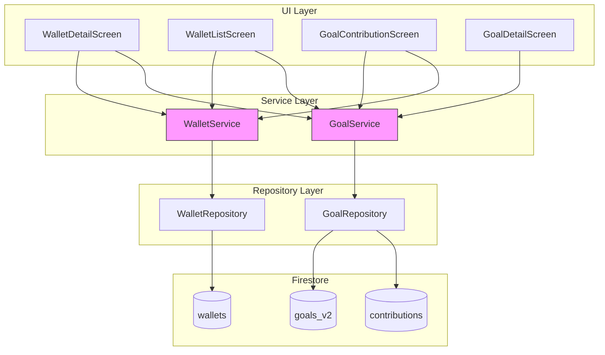
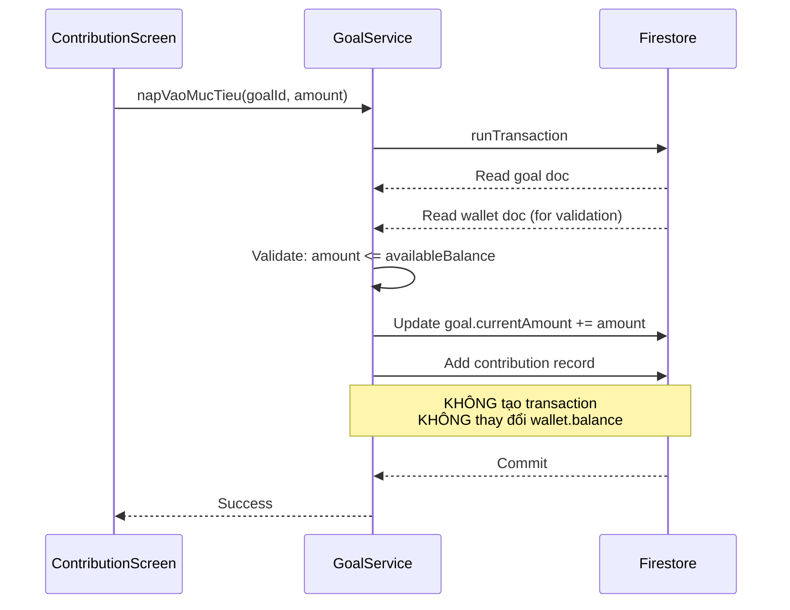

# Tài liệu Thiết kế: Goal Earmark Balance & Wallet Types

## Tổng quan

Thiết kế này refactor cách mục tiêu tiết kiệm tương tác với ví trong ứng dụng WeSpend. Thay vì tạo giao dịch thu/chi giả khi nạp/rút mục tiêu, hệ thống sẽ sử dụng cơ chế "earmark" — đánh dấu một phần số dư ví là đã phân bổ cho mục tiêu. Đồng thời, hệ thống thêm phân loại ví (normal, saving, debt) để mỗi loại ví có giao diện và chức năng phù hợp.

### Thay đổi chính:
1. `napVaoMucTieu` và `rutTuMucTieu` không còn tạo transaction hoặc thay đổi wallet balance
2. Earmarked amount được tính toán động từ tổng `currentAmount` của các goal active liên kết ví
3. Wallet model thêm trường `type` (normal/saving/debt)
4. UI hiển thị earmark info chỉ trên ví có goal liên kết
5. Ví saving có FAB nạp mục tiêu, ví debt có FAB trả nợ

## Kiến trúc



### Luồng nạp tiền mới (không tạo transaction):



## Thành phần và Giao diện

### 1. Wallet Model (cập nhật)

```dart
enum WalletType {
  normal,
  saving,
  debt;

  String get displayName {
    switch (this) {
      case WalletType.normal: return 'Ví thường';
      case WalletType.saving: return 'Ví tiết kiệm';
      case WalletType.debt: return 'Ví nợ';
    }
  }

  String get emoji {
    switch (this) {
      case WalletType.normal: return '💰';
      case WalletType.saving: return '🏦';
      case WalletType.debt: return '💳';
    }
  }
}

class Wallet {
  final String? id;
  final String name;
  final int balance;
  final int initialBalance;
  final String currency;
  final WalletType type; // MỚI

  Wallet({
    this.id,
    required this.name,
    this.balance = 0,
    this.initialBalance = 0,
    this.currency = 'VND',
    this.type = WalletType.normal, // MỚI - mặc định normal
  });
}
```

### 2. GoalService (refactor napVaoMucTieu / rutTuMucTieu)

```dart
// Interface mới cho GoalService
class GoalService {
  /// Nạp tiền vào mục tiêu - CHỈ cập nhật goal, KHÔNG tạo transaction
  Future<void> napVaoMucTieu(String goalId, int amount, {String? note});

  /// Rút tiền từ mục tiêu - CHỈ cập nhật goal, KHÔNG tạo transaction  
  Future<void> rutTuMucTieu(String goalId, int amount, {String? note});

  /// Tính tổng earmarked amount cho một ví
  Future<int> getEarmarkedAmount(String walletId);

  /// Stream earmarked amount cho một ví (realtime)
  Stream<int> watchEarmarkedAmount(String walletId);

  /// Lấy danh sách goal active theo walletId
  Future<List<Goal>> getGoalsByWallet(String walletId);

  /// Stream goal active theo walletId
  Stream<List<Goal>> watchGoalsByWallet(String walletId);

  /// Hủy mục tiêu - đặt currentAmount = 0, status = cancelled
  Future<void> cancelGoal(String id);
}
```

### 3. GoalRepository (thêm query theo walletId)

```dart
class GoalRepository {
  /// Query goals active theo funding_wallet_id
  Future<List<Goal>> getActiveGoalsByWallet(String walletId);
  
  /// Stream goals active theo funding_wallet_id
  Stream<List<Goal>> watchActiveGoalsByWallet(String walletId);
}
```

### 4. WalletRepository (cập nhật serialization)

```dart
class WalletRepository extends FirestoreRepository<Wallet> {
  @override
  Wallet fromFirestore(String id, Map<String, dynamic> data) => Wallet(
    id: id,
    name: data['name'] ?? '',
    balance: data['balance'] ?? 0,
    initialBalance: data['initial_balance'] ?? 0,
    currency: data['currency'] ?? 'VND',
    type: WalletType.values.firstWhere(
      (e) => e.name == data['type'],
      orElse: () => WalletType.normal, // backward compatible
    ),
  );

  @override
  Map<String, dynamic> toFirestore(Wallet item) => {
    'name': item.name,
    'balance': item.balance,
    'initial_balance': item.initialBalance,
    'currency': item.currency,
    'type': item.type.name,
  };
}
```

### 5. UI Components

#### WalletDetailScreen — Balance Card mới (ví có goal):
```
┌─────────────────────────────┐
│     Tổng số dư              │
│     5,000,000 ₫             │
│                             │
│  Đã phân bổ    Khả dụng    │
│  2,000,000 ₫   3,000,000 ₫ │
│                             │
│  ── Mục tiêu tiết kiệm ──  │
│  🏠 Mua nhà    1,500,000 ₫ │
│  ✈️ Du lịch      500,000 ₫ │
│                             │
│  ── Giao dịch gần đây ──   │
│  ...                        │
└─────────────────────────────┘
```

#### WalletDetailScreen — Ví saving có FAB:
```
┌─────────────────────────────┐
│  [Balance card + goals]     │
│  [Recent transactions]      │
│                             │
│              [🏦 Nạp mục tiêu] ← FAB
└─────────────────────────────┘
```

#### WalletDetailScreen — Ví debt:
```
┌─────────────────────────────┐
│     Nợ ban đầu              │
│     10,000,000 ₫            │
│                             │
│  Đã trả        Còn nợ      │
│  3,000,000 ₫   7,000,000 ₫ │
│                             │
│  ── Giao dịch gần đây ──   │
│  ...                        │
│              [💳 Trả nợ] ← FAB
└─────────────────────────────┘
```

#### WalletListScreen — Item ví có goal:
```
┌─────────────────────────────┐
│ 🏦 Ví tiết kiệm  5,000,000 │
│                   KD: 3,000,000 │
└─────────────────────────────┘
```

#### GoalContributionScreen — Hiển thị available balance:
```
┌─────────────────────────────┐
│  Chọn mục tiêu:            │
│  [🏠 Mua nhà ✓]            │
│                             │
│  Số dư khả dụng: 3,000,000 │
│  Số tiền: [________]       │
│  Ghi chú: [________]       │
│  [Nạp tiền]                │
└─────────────────────────────┘
```

## Mô hình Dữ liệu

### Firestore Schema

#### Collection: `wallets` (cập nhật)
```
{
  "name": "Ví tiết kiệm",
  "balance": 5000000,
  "initial_balance": 5000000,
  "currency": "VND",
  "type": "saving",          // MỚI: "normal" | "saving" | "debt"
  "created_at": Timestamp,
  "updated_at": Timestamp
}
```

#### Collection: `goals_v2` (không thay đổi schema)
```
{
  "account_id": "...",
  "name": "Mua nhà",
  "category": "home",
  "target_amount": 100000000,
  "current_amount": 1500000,
  "target_date": 1735689600000,
  "funding_wallet_id": "wallet_abc",  // liên kết ví
  "status": "active",
  "created_by": "user_123",
  "created_at": 1700000000000,
  "updated_at": 1700000000000
}
```

#### Subcollection: `goals_v2/{goalId}/contributions` (bỏ transaction_id)
```
{
  "goal_id": "goal_xyz",
  "amount": 500000,           // dương = nạp, âm = rút
  "date": 1700000000000,
  "note": "Tiết kiệm tháng 1",
  "created_by": "user_123",
  "created_at": 1700000000000
  // KHÔNG CÒN: "transaction_id"
}
```

### Tính toán Earmarked Amount

Earmarked amount cho một ví được tính động (không lưu trữ):

```
earmarkedAmount(walletId) = SUM(goal.currentAmount) 
  WHERE goal.fundingWalletId == walletId 
  AND goal.status == 'active'

availableBalance(walletId) = wallet.balance - earmarkedAmount(walletId)
```

Lý do tính động thay vì lưu trữ:
- Tránh data inconsistency khi goal bị xóa/hủy
- Không cần migration cho dữ liệu cũ
- Firestore query theo `funding_wallet_id` + `status` đủ nhanh cho số lượng goal nhỏ (thường < 20 goal/account)


## Correctness Properties

*Correctness property (thuộc tính đúng đắn) là một đặc tính hoặc hành vi phải luôn đúng trong mọi lần thực thi hợp lệ của hệ thống — về cơ bản là một phát biểu hình thức về những gì hệ thống phải làm. Các property đóng vai trò cầu nối giữa đặc tả dễ đọc cho con người và đảm bảo tính đúng đắn có thể kiểm chứng bằng máy.*

### Property 1: Goal operations không ảnh hưởng wallet balance và không tạo transaction

*For any* mục tiêu active và bất kỳ thao tác nào (nạp tiền, rút tiền, hủy, xóa), `wallet.balance` trước và sau thao tác phải bằng nhau, và không có document mới nào được tạo trong collection `transactions`.

**Validates: Requirements 1.1, 1.2, 2.1, 2.2, 6.3**

### Property 2: Nạp tiền tăng currentAmount đúng số tiền

*For any* mục tiêu active với `currentAmount = C` và số tiền nạp hợp lệ `A` (0 < A <= availableBalance), sau khi gọi `napVaoMucTieu`, `goal.currentAmount` phải bằng `C + A` và một bản ghi contribution với `amount = A` phải tồn tại.

**Validates: Requirements 1.1**

### Property 3: Rút tiền giảm currentAmount đúng số tiền

*For any* mục tiêu với `currentAmount = C > 0` và số tiền rút hợp lệ `A` (0 < A <= C), sau khi gọi `rutTuMucTieu`, `goal.currentAmount` phải bằng `C - A` và một bản ghi contribution với `amount = -A` phải tồn tại.

**Validates: Requirements 2.1**

### Property 4: Mục tiêu tự động hoàn thành khi đạt target

*For any* mục tiêu active với `currentAmount + contributionAmount >= targetAmount`, sau khi nạp tiền, `goal.status` phải là `completed`.

**Validates: Requirements 1.3**

### Property 5: Earmarked amount và available balance tính đúng

*For any* ví và tập hợp mục tiêu active liên kết với ví đó, `earmarkedAmount` phải bằng tổng `currentAmount` của các mục tiêu đó, và `availableBalance` phải bằng `wallet.balance - earmarkedAmount`.

**Validates: Requirements 3.1, 3.2, 3.3**

### Property 6: Nạp tiền không hợp lệ bị từ chối và không thay đổi state

*For any* thao tác nạp tiền với điều kiện không hợp lệ (amount > availableBalance, amount <= 0, hoặc goal không active), thao tác phải thất bại và `goal.currentAmount` phải giữ nguyên giá trị ban đầu.

**Validates: Requirements 4.1, 4.2, 4.3**

### Property 7: Rút tiền vượt quá currentAmount bị từ chối

*For any* mục tiêu với `currentAmount = C` và số tiền rút `A > C`, thao tác `rutTuMucTieu` phải thất bại và `goal.currentAmount` phải giữ nguyên `C`.

**Validates: Requirements 2.3**

### Property 8: Hủy mục tiêu giải phóng earmark

*For any* mục tiêu active với `currentAmount = C > 0`, sau khi hủy, `goal.currentAmount` phải bằng 0 và earmarked amount của ví liên kết phải giảm đi `C`.

**Validates: Requirements 6.1**

### Property 9: Wallet type serialization round-trip

*For any* giá trị `WalletType` (normal, saving, debt), serialize thành Map rồi deserialize lại phải cho ra cùng giá trị `WalletType` ban đầu.

**Validates: Requirements 9.1, 9.4**

## Xử lý Lỗi

| Tình huống | Xử lý | Thông báo |
|---|---|---|
| Nạp tiền > available balance | Throw Exception, không thay đổi state | "Số tiền vượt quá số dư khả dụng" |
| Nạp tiền <= 0 | Throw Exception | "Số tiền phải lớn hơn 0" |
| Nạp vào goal không active | Throw Exception | "Mục tiêu không ở trạng thái hoạt động" |
| Rút tiền > currentAmount | Throw Exception | "Số tiền rút vượt quá số tiền đã nạp" |
| Goal không tồn tại | Throw Exception | "Không tìm thấy mục tiêu" |
| Wallet không tồn tại | Throw Exception | "Không tìm thấy ví" |
| Firestore transaction conflict | Retry (Firestore tự xử lý) | — |

### Backward Compatibility

- Ví cũ không có trường `type` sẽ mặc định là `normal` (xử lý trong `fromFirestore`)
- Contribution cũ có `transaction_id` sẽ vẫn hiển thị bình thường (field bị bỏ qua)
- Các transaction cũ đã tạo bởi goal contribution/withdrawal vẫn tồn tại trong Firestore nhưng không ảnh hưởng logic mới
- Không cần migration — tất cả thay đổi đều backward compatible

## Chiến lược Testing

### Property-Based Testing

- Sử dụng thư viện `fast_check` cho Dart (hoặc custom property test runner nếu `fast_check` không khả dụng)
- Mỗi property test chạy tối thiểu 100 iterations
- Mỗi test phải có comment tham chiếu đến property trong design document
- Format tag: **Feature: goal-earmark-balance, Property {number}: {property_text}**

### Unit Tests

Unit tests bổ sung cho property tests, tập trung vào:
- Các ví dụ cụ thể (specific examples) cho từng thao tác
- Edge cases: currentAmount = 0, currentAmount = targetAmount, availableBalance = 0
- Integration giữa GoalService và GoalRepository
- Widget tests cho UI components (balance card, FAB visibility)

### Dual Testing Approach

| Loại test | Mục đích | Ví dụ |
|---|---|---|
| Property test | Kiểm tra tính đúng đắn tổng quát | "Mọi thao tác goal không thay đổi wallet balance" |
| Unit test | Kiểm tra ví dụ cụ thể và edge cases | "Nạp 100k vào goal có currentAmount = 0" |
| Widget test | Kiểm tra UI hiển thị đúng | "Ví saving hiển thị FAB nạp mục tiêu" |

### Test Structure

```
test/
  features/
    goal/
      services/
        goal_service_test.dart          # Unit tests
        goal_service_property_test.dart # Property tests (P1-P8)
      models/
        goal_test.dart
    wallet/
      models/
        wallet_test.dart                # Unit + Property test (P9)
      screens/
        wallet_detail_screen_test.dart  # Widget tests
```
