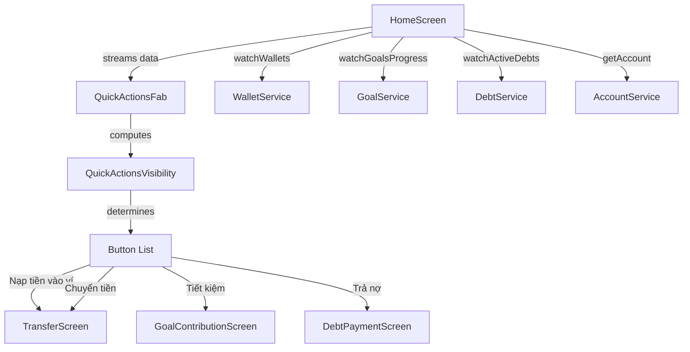

# Design Document: Home Quick Actions Redesign

## Overview

Redesign QuickActionsFab để hiển thị danh sách nút hành động theo ngữ cảnh (context-aware) thay vì danh sách cố định. Widget sẽ nhận dữ liệu từ bên ngoài (Account, wallets, goals, debts) và tự xác định nút nào cần hiển thị. Khi không có nút nào phù hợp, FAB sẽ bị ẩn hoàn toàn.

Thay đổi chính:
- Loại bỏ nút "Thêm thu chi" (đã có QuickAddBar)
- Thêm visibility logic dựa trên: account type, wallet count, active goals, active debts
- HomeScreen cung cấp dữ liệu reactive (streams) cho QuickActionsFab
- FAB tự ẩn khi không có action nào applicable

## Architecture



Kiến trúc tách biệt visibility logic ra khỏi widget thông qua class `QuickActionsVisibility`. HomeScreen chịu trách nhiệm lắng nghe streams và truyền dữ liệu xuống FAB. FAB sử dụng `QuickActionsVisibility` để tính toán danh sách nút cần hiển thị.

## Components and Interfaces

### 1. QuickActionsVisibility (Pure Logic Class)

File: `lib/common/widgets/quick_actions_visibility.dart`

Class thuần logic (không phụ thuộc Flutter) chịu trách nhiệm xác định nút nào cần hiển thị.

```dart
/// Đầu vào cho visibility logic
class QuickActionsInput {
  final bool isFamily;
  final int walletCount;
  final bool hasActiveGoals;
  final bool hasActiveDebts;
}

/// Enum cho các loại quick action
enum QuickActionType {
  funding,      // Nạp tiền vào ví (family only)
  transfer,     // Chuyển tiền (≥2 wallets)
  goalContribution, // Tiết kiệm (has active goals)
  debtPayment,  // Trả nợ (has active debts)
}

/// Pure function: input → list of visible actions
class QuickActionsVisibility {
  static List<QuickActionType> resolve(QuickActionsInput input) {
    // Returns ordered list of applicable actions
  }
}
```

### 2. QuickActionsFab (Refactored Widget)

File: `lib/common/widgets/quick_actions_fab.dart`

Refactor widget hiện tại để:
- Nhận `QuickActionsInput` thay vì hardcode danh sách nút
- Sử dụng `QuickActionsVisibility.resolve()` để xác định nút hiển thị
- Giữ nguyên animation và overlay behavior hiện tại
- Tự ẩn khi danh sách nút rỗng

```dart
class QuickActionsFab extends StatefulWidget {
  final double bottomOffset;
  final QuickActionsInput actionsInput;

  const QuickActionsFab({
    super.key,
    this.bottomOffset = 16,
    required this.actionsInput,
  });
}
```

### 3. HomeScreen (Data Provider)

File: `lib/features/home/screens/home_screen.dart`

HomeScreen sẽ:
- Lắng nghe thêm streams cho goals và debts
- Lấy thông tin Account (isFamily)
- Tạo `QuickActionsInput` từ dữ liệu reactive
- Truyền input xuống QuickActionsFab
- Ẩn FAB khi không có action nào (resolve trả về list rỗng)

## Data Models

### QuickActionsInput

```dart
class QuickActionsInput {
  final bool isFamily;
  final int walletCount;
  final bool hasActiveGoals;
  final bool hasActiveDebts;

  const QuickActionsInput({
    required this.isFamily,
    required this.walletCount,
    required this.hasActiveGoals,
    required this.hasActiveDebts,
  });
}
```

### QuickActionType

```dart
enum QuickActionType {
  funding,
  transfer,
  goalContribution,
  debtPayment;
}
```

### Visibility Rules (Truth Table)

| Action | Condition | Requirement |
|--------|-----------|-------------|
| `funding` | `isFamily == true` | Req 2.1, 2.2 |
| `transfer` | `walletCount >= 2` | Req 3.1, 3.2 |
| `goalContribution` | `hasActiveGoals == true` | Req 4.1, 4.2 |
| `debtPayment` | `hasActiveDebts == true` | Req 5.1, 5.2 |

Thứ tự hiển thị cố định: funding → transfer → goalContribution → debtPayment (theo thứ tự ưu tiên sử dụng).

### Service Dependencies

GoalService hiện chưa được đăng ký trong ServiceLocator. Cần thêm `goalService` vào `ServiceLocator` để HomeScreen có thể lắng nghe `watchGoalsProgress()` stream.

| Service | Method | Returns |
|---------|--------|---------|
| `accountService` | `getAccount(id)` | `Account?` (check `isFamily`) |
| `walletService` | `watchWallets()` | `Stream<List<Wallet>>` (count for transfer) |
| `GoalService` | `watchGoalsProgress()` | `Stream<List<Goal>>` (filter active) |
| `debtService` | `watchActiveDebts()` | `Stream<List<Debt>>` (check non-empty) |


## Correctness Properties

*A property is a characteristic or behavior that should hold true across all valid executions of a system — essentially, a formal statement about what the system should do. Properties serve as the bridge between human-readable specifications and machine-verifiable correctness guarantees.*

Visibility logic là phần cốt lõi của feature này. Vì `QuickActionsVisibility.resolve()` là pure function (input → output, không side effects), nó rất phù hợp cho property-based testing. Mỗi property dưới đây kiểm tra biconditional: điều kiện đầu vào ↔ action có mặt trong kết quả.

### Property 1: Funding visibility biconditional

*For any* `QuickActionsInput`, the `funding` action appears in the result of `resolve()` if and only if `isFamily` is `true`.

**Validates: Requirements 2.1, 2.2**

### Property 2: Transfer visibility biconditional

*For any* `QuickActionsInput`, the `transfer` action appears in the result of `resolve()` if and only if `walletCount >= 2`.

**Validates: Requirements 3.1, 3.2**

### Property 3: Goal contribution visibility biconditional

*For any* `QuickActionsInput`, the `goalContribution` action appears in the result of `resolve()` if and only if `hasActiveGoals` is `true`.

**Validates: Requirements 4.1, 4.2**

### Property 4: Debt payment visibility biconditional

*For any* `QuickActionsInput`, the `debtPayment` action appears in the result of `resolve()` if and only if `hasActiveDebts` is `true`.

**Validates: Requirements 5.1, 5.2**

## Error Handling

| Tình huống | Xử lý |
|------------|-------|
| Account chưa load xong (null) | Mặc định `isFamily = false`, FAB ẩn nút funding |
| Wallet stream chưa có data | Mặc định `walletCount = 0`, FAB ẩn nút transfer |
| Goal stream chưa có data | Mặc định `hasActiveGoals = false`, FAB ẩn nút tiết kiệm |
| Debt stream chưa có data | Mặc định `hasActiveDebts = false`, FAB ẩn nút trả nợ |
| Tất cả conditions đều false | FAB bị ẩn hoàn toàn (Req 7.1) |
| GoalService chưa có trong ServiceLocator | Cần thêm vào ServiceLocator trước khi sử dụng |

Nguyên tắc: khi dữ liệu chưa sẵn sàng, mặc định ẩn nút (safe default). Khi stream emit data mới, widget rebuild và cập nhật visibility.

## Testing Strategy

### Property-Based Testing

Sử dụng package `dart_check` (hoặc tương đương) cho property-based testing trên Dart.

Vì `QuickActionsVisibility.resolve()` là pure function nhận `QuickActionsInput` và trả về `List<QuickActionType>`, ta có thể generate random inputs và verify properties.

**Generator cho QuickActionsInput:**
- `isFamily`: random bool
- `walletCount`: random int trong khoảng 0–10
- `hasActiveGoals`: random bool
- `hasActiveDebts`: random bool

**Cấu hình:**
- Mỗi property test chạy tối thiểu 100 iterations
- Mỗi test annotate với property number và requirement reference

**Tag format:** `Feature: home-quick-actions-redesign, Property {N}: {title}`

### Unit Testing

Unit tests bổ sung cho các edge cases và ví dụ cụ thể:

1. **Ví dụ: Personal account, 1 wallet, no goals, no debts** → resolve trả về list rỗng (Req 7.1)
2. **Ví dụ: Family account, 3 wallets, active goals, active debts** → resolve trả về tất cả 4 actions
3. **Ví dụ: Personal account, 2 wallets, no goals, active debts** → resolve trả về [transfer, debtPayment]
4. **Edge case: walletCount = 0** → transfer không hiển thị
5. **Edge case: walletCount = 1** → transfer không hiển thị
6. **Edge case: walletCount = 2** → transfer hiển thị (boundary)

### Widget Testing

Widget tests cho QuickActionsFab (không thuộc property-based testing):
- Verify FAB ẩn khi resolve trả về list rỗng
- Verify đúng số nút hiển thị khi expand
- Verify navigation khi tap từng nút
