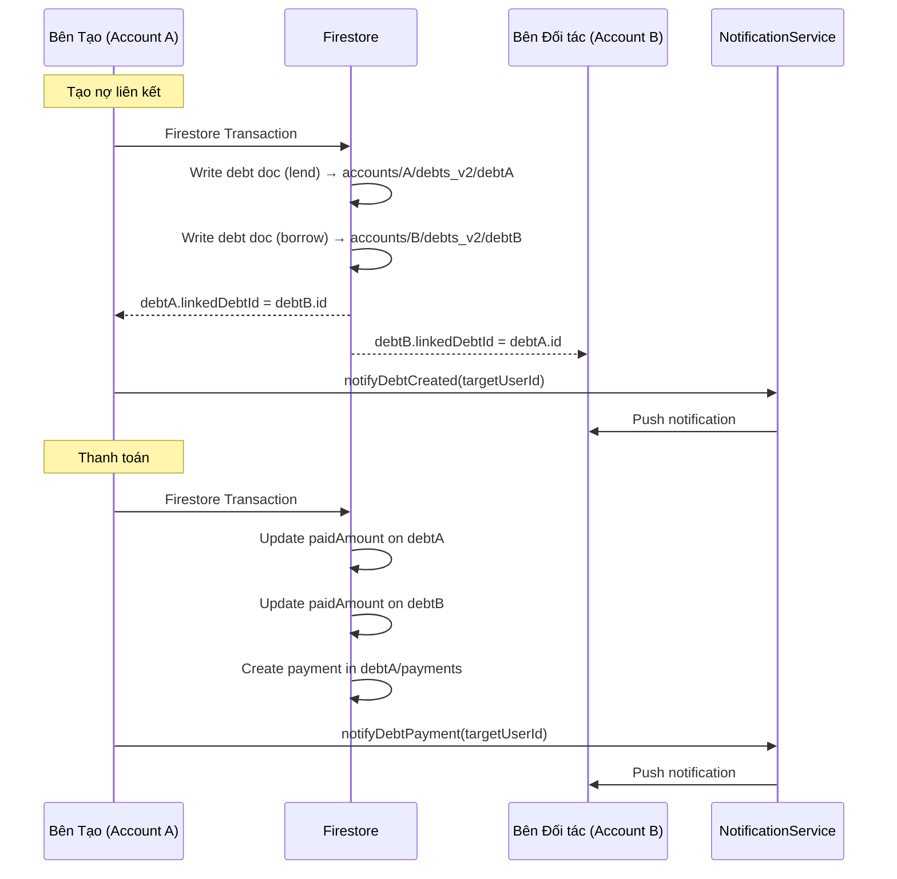

# Thiết kế: Nợ Liên kết (Linked Debt)

## Tổng quan

Tính năng Nợ Liên kết mở rộng hệ thống quản lý nợ hiện tại để hỗ trợ liên kết giữa hai người dùng trong app. Thiết kế tuân theo pattern đã có trong tính năng chuyển khoản (transfer): sử dụng Firestore transaction để ghi đồng thời vào 2 subcollection khác nhau (`accounts/{accountId}/debts_v2/{debtId}`), với các trường liên kết (`linkedDebtId`, `linkedAccountId`) trỏ chéo giữa 2 document.

Các thay đổi chính:
- Mở rộng Debt model với 3 trường nullable mới
- Thêm luồng tạo nợ liên kết trong DebtService (tương tự `createTransfer`)
- Mở rộng luồng thanh toán để đồng bộ cả 2 bên
- Thêm UI tìm kiếm người dùng qua email trên DebtFormScreen
- Tích hợp NotificationService cho các sự kiện nợ liên kết

## Kiến trúc

### Luồng dữ liệu tổng quan



### Cấu trúc Firestore

```
accounts/{accountId}/debts_v2/{debtId}
  ├── ... (các trường hiện tại)
  ├── linked_debt_id: string | null       // ID của debt doc bên kia
  ├── linked_account_id: string | null    // Account ID bên kia
  ├── party_user_id: string | null        // User ID của đối tác
  └── payments/{paymentId}
        └── ... (các trường hiện tại)
```

## Thành phần và Giao diện

### 1. Debt Model (mở rộng)

Mở rộng class `Debt` hiện tại tại `lib/features/debt/models/debt.dart`:

```dart
class Debt {
  // ... các trường hiện tại ...
  final String? linkedDebtId;
  final String? linkedAccountId;
  final String? partyUserId;

  bool get isLinked => linkedDebtId != null;
}
```

Cập nhật `fromMap()`:
```dart
linkedDebtId: data['linked_debt_id'],
linkedAccountId: data['linked_account_id'],
partyUserId: data['party_user_id'],
```

Cập nhật `toMap()`:
```dart
if (linkedDebtId != null) 'linked_debt_id': linkedDebtId,
if (linkedAccountId != null) 'linked_account_id': linkedAccountId,
if (partyUserId != null) 'party_user_id': partyUserId,
```

### 2. DebtService (mở rộng)

Thêm các method mới vào `DebtService`:

#### `choVayLienKet()` — Tạo nợ liên kết loại cho vay

```dart
Future<String> choVayLienKet({
  required String partyUserId,
  required String partyAccountId,
  required String partyName,
  required int amount,
  String? walletId,
  DateTime? dueDate,
  double? interestRate,
  String? description,
}) async {
  // 1. Pre-generate 2 doc refs trong 2 account subcollections
  // 2. Firestore transaction:
  //    a. Set doc lend trong account hiện tại (linkedDebtId = docB.id)
  //    b. Set doc borrow trong partyAccountId (linkedDebtId = docA.id)
  // 3. Gửi notification đến partyUserId
  // 4. Return docA.id
}
```

#### `vayMuonLienKet()` — Tạo nợ liên kết loại vay mượn

Tương tự `choVayLienKet()` nhưng đảo type: borrow cho bên tạo, lend cho bên đối tác.

#### Mở rộng `nhanTienTra()` và `traNop()`

```dart
// Trong Firestore transaction hiện tại, thêm:
// 1. Đọc debt doc → kiểm tra linkedDebtId
// 2. Nếu isLinked:
//    a. Đọc linked debt doc từ linkedAccountId
//    b. Cập nhật paidAmount trên linked debt doc
//    c. Cập nhật status nếu completed
//    d. Gửi notification đến partyUserId
```

#### Mở rộng `cancelDebt()` và `deleteDebt()`

```dart
// 1. Đọc debt doc → kiểm tra linkedDebtId
// 2. Nếu isLinked:
//    a. Gỡ liên kết trên linked debt doc (xóa linked_debt_id, linked_account_id)
//    b. Gửi notification đến partyUserId
// 3. Thực hiện cancel/delete bình thường trên debt doc hiện tại
```

### 3. DebtFormScreen (mở rộng UI)

Thêm khả năng tìm kiếm người dùng qua email:

```
┌─────────────────────────────────┐
│  [Cho vay]  [Vay mượn]         │
├─────────────────────────────────┤
│  Đối tác:                       │
│  ○ Nhập tên (free-text)         │
│  ○ Tìm người dùng (email)      │
│                                 │
│  [Nếu chọn tìm email:]         │
│  ┌─────────────────────────┐    │
│  │ 📧 Nhập email...        │    │
│  └─────────────────────────┘    │
│  ✅ Nguyễn Văn A               │
│     (nguyenvana@email.com)      │
│                                 │
│  Số tiền: ___________           │
│  Ví: [Dropdown]                 │
│  Ngày đáo hạn: ___________     │
│  Lãi suất: ___________         │
│  Ghi chú: ___________          │
│                                 │
│  [Tạo khoản nợ]                │
└─────────────────────────────────┘
```

Luồng UI:
1. Người dùng chọn giữa "Nhập tên" (free-text, hành vi hiện tại) hoặc "Tìm người dùng" (email lookup)
2. Nếu chọn "Tìm người dùng": hiển thị trường email, gọi `AccountService._findUserIdByEmail()` (cần expose thành public method)
3. Khi tìm thấy: hiển thị tên người dùng, lưu `partyUserId` và `partyAccountId`
4. Khi không tìm thấy: hiển thị lỗi, cho phép quay lại nhập tên free-text
5. Khi submit: gọi `choVayLienKet()` hoặc `vayMuonLienKet()` thay vì `choVay()`/`vayMuon()`

### 4. DebtDetailScreen (mở rộng)

Hiển thị thông tin liên kết:
- Badge/icon cho biết đây là nợ liên kết
- Hiển thị tên đối tác (từ partyName, giống hiện tại)
- Trạng thái liên kết (đang liên kết / đã gỡ liên kết)

### 5. NotificationService (mở rộng)

Thêm 3 method mới:

```dart
Future<void> notifyDebtCreated({
  required String targetUserId,
  required String creatorName,
  required int amount,
  required String debtType, // 'lend' hoặc 'borrow'
})

Future<void> notifyDebtPayment({
  required String targetUserId,
  required String payerName,
  required int amount,
  required int remainingAmount,
})

Future<void> notifyDebtCompleted({
  required String targetUserId,
  required String partyName,
  required int totalAmount,
})
```

### 6. AccountService (mở rộng)

Expose method tìm user qua email:

```dart
// Đổi từ private sang public
Future<String?> findUserIdByEmail(String email) async {
  final doc = await _userEmails.doc(email.toLowerCase()).get();
  if (!doc.exists) return null;
  return (doc.data() as Map<String, dynamic>)['user_id'] as String?;
}
```

## Mô hình Dữ liệu

### Debt Document (mở rộng)

| Trường | Kiểu | Mô tả | Mới? |
|--------|------|-------|------|
| account_id | String | Account ID sở hữu | Không |
| type | String | "lend" hoặc "borrow" | Không |
| party_name | String | Tên đối tác | Không |
| party_contact | String? | SĐT đối tác | Không |
| total_amount | int | Tổng số tiền nợ | Không |
| paid_amount | int | Số tiền đã trả | Không |
| due_date | int? | Timestamp ngày đáo hạn | Không |
| interest_rate | double? | Lãi suất % | Không |
| description | String? | Ghi chú | Không |
| wallet_id | String? | Ví liên kết | Không |
| status | String | "active", "completed", "cancelled" | Không |
| created_at | int | Timestamp tạo | Không |
| updated_at | int | Timestamp cập nhật | Không |
| linked_debt_id | String? | ID debt doc bên kia | **Mới** |
| linked_account_id | String? | Account ID bên kia | **Mới** |
| party_user_id | String? | User ID đối tác | **Mới** |

### Quy tắc liên kết

- Nợ liên kết: `linkedDebtId != null && linkedAccountId != null && partyUserId != null`
- Nợ tự do: `linkedDebtId == null` (hành vi hiện tại, không thay đổi)
- Khi một bên hủy/xóa: bên kia chuyển thành nợ tự do (xóa `linkedDebtId`, `linkedAccountId`)

### Ví dụ cặp document liên kết

**Account A (Bên cho vay):**
```json
{
  "type": "lend",
  "party_name": "Nguyễn Văn B",
  "total_amount": 5000000,
  "paid_amount": 0,
  "status": "active",
  "linked_debt_id": "debtB_id",
  "linked_account_id": "accountB_id",
  "party_user_id": "userB_id"
}
```

**Account B (Bên vay):**
```json
{
  "type": "borrow",
  "party_name": "Trần Văn A",
  "total_amount": 5000000,
  "paid_amount": 0,
  "status": "active",
  "linked_debt_id": "debtA_id",
  "linked_account_id": "accountA_id",
  "party_user_id": "userA_id"
}
```


## Thuộc tính Đúng đắn (Correctness Properties)

*Thuộc tính đúng đắn là một đặc điểm hoặc hành vi phải luôn đúng trong mọi lần thực thi hợp lệ của hệ thống — về cơ bản là một phát biểu hình thức về những gì hệ thống phải làm. Các thuộc tính đóng vai trò cầu nối giữa đặc tả dễ đọc cho con người và đảm bảo tính đúng đắn có thể kiểm chứng bằng máy.*

### Property 1: Tra cứu email trả về đúng userId

*Với mọi* email đã đăng ký trong hệ thống, hàm `findUserIdByEmail(email)` phải trả về userId tương ứng với email đó. Với mọi email chưa đăng ký, hàm phải trả về null.

**Validates: Requirements 1.1**

### Property 2: Nợ liên kết lưu đúng thông tin đối tác

*Với mọi* khoản nợ liên kết được tạo với một người dùng trong app, document nợ phải có `partyUserId` bằng userId của đối tác và `linkedAccountId` bằng accountId của đối tác.

**Validates: Requirements 1.3**

### Property 3: Cặp nợ liên kết có type đảo ngược

*Với mọi* cặp nợ liên kết được tạo, nếu document bên tạo có type "lend" thì document bên đối tác phải có type "borrow", và ngược lại.

**Validates: Requirements 2.1, 2.2**

### Property 4: Cặp nợ liên kết có tham chiếu chéo đúng

*Với mọi* cặp nợ liên kết (debtA, debtB), phải thỏa mãn: `debtA.linkedDebtId == debtB.id` VÀ `debtB.linkedDebtId == debtA.id` VÀ `debtA.linkedAccountId == debtB.accountId` VÀ `debtB.linkedAccountId == debtA.accountId` VÀ `debtA.partyUserId != null` VÀ `debtB.partyUserId != null`.

**Validates: Requirements 2.3, 2.4**

### Property 5: Cặp nợ liên kết có các trường chia sẻ bằng nhau

*Với mọi* cặp nợ liên kết (debtA, debtB), phải thỏa mãn: `debtA.totalAmount == debtB.totalAmount` VÀ `debtA.dueDate == debtB.dueDate` VÀ `debtA.interestRate == debtB.interestRate` VÀ `debtA.description == debtB.description`.

**Validates: Requirements 2.5**

### Property 6: Đồng bộ thanh toán — paidAmount và status nhất quán

*Với mọi* khoản nợ liên kết và mọi khoản thanh toán hợp lệ, sau khi thanh toán, cả 2 document nợ phải có cùng `paidAmount`. Nếu `paidAmount >= totalAmount`, cả 2 document phải có `status == "completed"`.

**Validates: Requirements 3.1, 3.2**

### Property 7: Hủy/xóa gỡ liên kết bên kia

*Với mọi* cặp nợ liên kết, khi một bên hủy hoặc xóa khoản nợ, document nợ bên kia phải có `linkedDebtId == null` (đã gỡ liên kết) và vẫn tồn tại với dữ liệu nguyên vẹn.

**Validates: Requirements 6.1, 6.3**

### Property 8: Round-trip serialization của Debt model

*Với mọi* đối tượng Debt hợp lệ (bao gồm cả trường liên kết), `Debt.fromMap(id, debt.toMap())` phải tạo ra đối tượng Debt tương đương với đối tượng ban đầu.

**Validates: Requirements 7.2**

### Property 9: isLinked computed property

*Với mọi* đối tượng Debt, `debt.isLinked` phải bằng `(debt.linkedDebtId != null)`.

**Validates: Requirements 7.4**

## Xử lý Lỗi

### Lỗi tìm kiếm người dùng
- Email không tồn tại → hiển thị thông báo, cho phép tạo nợ tự do
- Email trùng với chính mình → hiển thị lỗi "Không thể tạo nợ với chính mình"
- Lỗi mạng khi tra cứu → hiển thị lỗi chung, cho phép thử lại

### Lỗi tạo nợ liên kết
- Account đối tác không tồn tại → throw Exception, hiển thị lỗi
- Firestore transaction thất bại (conflict) → Firestore tự retry (tối đa 5 lần)
- Gửi notification thất bại → log lỗi, không ảnh hưởng đến tạo nợ (fire-and-forget)

### Lỗi thanh toán đồng bộ
- Document nợ liên kết không tồn tại (đã bị xóa) → chỉ cập nhật document nợ hiện tại, gỡ liên kết
- Số dư ví không đủ (cho traNop) → throw Exception "Số dư ví không đủ" (hành vi hiện tại)
- Firestore transaction thất bại → Firestore tự retry

### Lỗi hủy/xóa
- Document liên kết không tồn tại → tiếp tục hủy/xóa bình thường, không báo lỗi
- Firestore transaction thất bại → Firestore tự retry

## Chiến lược Kiểm thử

### Unit Tests
- Debt model: kiểm tra `fromMap()`, `toMap()`, `copyWith()` với các trường mới
- Debt model: kiểm tra `isLinked` computed property
- Debt model: kiểm tra backward compatibility với data cũ (không có trường liên kết)
- Validation: kiểm tra từ chối email trùng với chính mình

### Property-Based Tests

Sử dụng thư viện **`dart_check`** (hoặc tương đương) cho Dart/Flutter.

Mỗi property test phải chạy tối thiểu 100 iterations.

Mỗi test phải có comment tham chiếu đến property trong design document:
```dart
// Feature: linked-debt, Property N: [mô tả property]
```

Các property cần test:
1. **Property 8**: Round-trip serialization — generate random Debt objects (có và không có trường liên kết), verify `fromMap(id, toMap())` tạo ra đối tượng tương đương
2. **Property 9**: isLinked — generate random Debt objects, verify `isLinked == (linkedDebtId != null)`
3. **Property 3**: Type inversion — generate random linked debt creation params, verify 2 documents có type đảo ngược
4. **Property 4**: Cross-references — generate random linked debt pairs, verify tham chiếu chéo đúng
5. **Property 5**: Shared fields — generate random linked debt pairs, verify các trường chia sẻ bằng nhau
6. **Property 6**: Payment sync — generate random linked debts + payments, verify paidAmount và status nhất quán

### Integration Tests
- Tạo nợ liên kết end-to-end: verify 2 documents trong Firestore
- Thanh toán đồng bộ: verify cả 2 documents được cập nhật
- Hủy/xóa: verify gỡ liên kết đúng
- Backward compatibility: verify nợ tự do vẫn hoạt động
- Notification: verify notification được gửi đúng sự kiện
