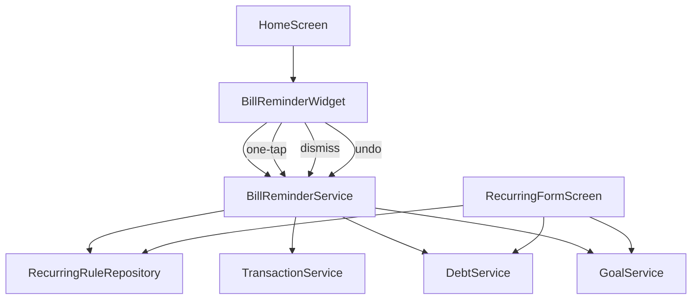
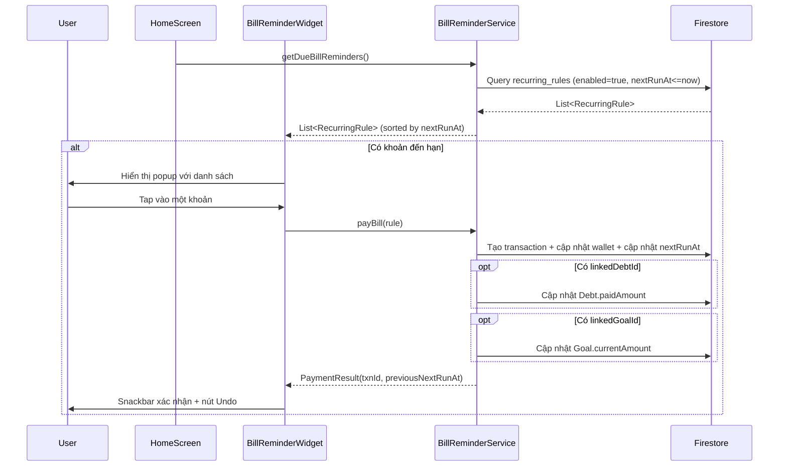

# Tài liệu Thiết kế: Recurring Bill Reminder

## Tổng quan

Chức năng Recurring Bill Reminder mở rộng hệ thống `RecurringRule` hiện có để:
1. Liên kết RecurringRule với Debt hoặc Goal
2. Hiển thị popup nhắc nhở trên Home Screen khi có khoản đến hạn
3. Cho phép thanh toán nhanh bằng một lần chạm (one-tap payment) — tự động tạo giao dịch, cập nhật Debt/Goal, và chuyển nextRunAt sang chu kỳ tiếp theo
4. Hỗ trợ bỏ qua (dismiss) và hoàn tác (undo)

Thiết kế tận dụng tối đa code hiện có: `RecurringService`, `TransactionService`, `DebtService`, `GoalService`, và cấu trúc Home Screen.

## Kiến trúc



### Luồng xử lý chính



## Thành phần và Giao diện

### 1. RecurringRule Model (mở rộng)

Thêm 2 trường tùy chọn vào model hiện có:

```dart
class RecurringRule {
  // ... các trường hiện có ...
  final String? linkedDebtId;   // ID khoản nợ liên kết
  final String? linkedGoalId;   // ID mục tiêu liên kết
}
```

Cập nhật `toMap()` và `fromMap()` tương ứng. Firestore document thêm fields: `linked_debt_id`, `linked_goal_id`.

### 2. BillReminderService

Service mới xử lý logic nghiệp vụ cho bill reminder:

```dart
class BillReminderService {
  /// Lấy danh sách rule đến hạn, sắp xếp theo nextRunAt tăng dần
  Future<List<RecurringRule>> getDueReminders();
  
  /// Stream realtime các rule đến hạn
  Stream<List<RecurringRule>> watchDueReminders();
  
  /// Thanh toán nhanh: tạo txn + cập nhật wallet + cập nhật nextRunAt + cập nhật Debt/Goal
  /// Trả về PaymentResult chứa txnId và previousNextRunAt (cho undo)
  Future<PaymentResult> payBill(RecurringRule rule);
  
  /// Bỏ qua: chỉ cập nhật nextRunAt sang chu kỳ tiếp theo
  Future<void> dismissBill(RecurringRule rule);
  
  /// Hoàn tác: xóa txn, khôi phục nextRunAt, hoàn tác Debt/Goal
  Future<void> undoPayment(PaymentResult result);
}
```

```dart
class PaymentResult {
  final String transactionId;
  final int previousNextRunAt;
  final String ruleId;
  final String? linkedDebtId;
  final String? linkedGoalId;
  final int amount;
}
```

### 3. BillReminderWidget

Widget hiển thị trên Home Screen:

```dart
class BillReminderWidget extends StatelessWidget {
  /// Danh sách các rule đến hạn
  final List<RecurringRule> dueReminders;
  /// Callback khi user tap thanh toán
  final ValueChanged<RecurringRule> onPay;
  /// Callback khi user dismiss
  final ValueChanged<RecurringRule> onDismiss;
}
```

UI: Card nổi bật với icon cảnh báo, hiển thị danh sách cuộn ngang hoặc dọc. Mỗi item hiển thị: emoji danh mục, tên ghi chú/danh mục, số tiền, tên ví. Tap = thanh toán, swipe = bỏ qua.

### 4. RecurringFormScreen (mở rộng)

Thêm phần chọn liên kết Debt/Goal vào form hiện có:
- Dropdown "Liên kết với" có 3 lựa chọn: Không, Khoản nợ, Mục tiêu
- Nếu chọn "Khoản nợ": hiển thị dropdown danh sách Debt active
- Nếu chọn "Mục tiêu": hiển thị dropdown danh sách Goal active
- Validation: không cho phép chọn cả hai

### 5. Tích hợp Home Screen

Thêm `BillReminderWidget` vào `HomeScreen` ListView, đặt phía trên `_buildTodayTotal()`. Sử dụng `StreamBuilder` lắng nghe `watchDueReminders()`.

## Mô hình Dữ liệu

### RecurringRule (Firestore: `recurring_rules`)

| Field | Type | Mô tả |
|-------|------|-------|
| amount | int | Số tiền |
| category_id | string | ID danh mục |
| wallet_id | string | ID ví nguồn |
| type | string | 'expense' hoặc 'income' |
| frequency | string | 'daily', 'weekly', 'monthly' |
| note | string? | Ghi chú |
| next_run_at | int | Timestamp (ms) lần chạy tiếp theo |
| enabled | bool | Đang hoạt động |
| **linked_debt_id** | **string?** | **ID khoản nợ liên kết (mới)** |
| **linked_goal_id** | **string?** | **ID mục tiêu liên kết (mới)** |

### PaymentResult (in-memory, không lưu Firestore)

| Field | Type | Mô tả |
|-------|------|-------|
| transactionId | String | ID giao dịch vừa tạo |
| previousNextRunAt | int | nextRunAt trước khi cập nhật (cho undo) |
| ruleId | String | ID của RecurringRule |
| linkedDebtId | String? | ID Debt nếu có liên kết |
| linkedGoalId | String? | ID Goal nếu có liên kết |
| amount | int | Số tiền đã thanh toán |


## Correctness Properties

*Một property (thuộc tính đúng đắn) là một đặc điểm hoặc hành vi phải luôn đúng trong mọi lần thực thi hợp lệ của hệ thống — về cơ bản là một phát biểu hình thức về những gì hệ thống phải làm. Properties đóng vai trò cầu nối giữa đặc tả dễ đọc cho con người và đảm bảo tính đúng đắn có thể kiểm chứng bằng máy.*

### Property 1: RecurringRule serialization round-trip

*For any* RecurringRule (bao gồm cả trường linkedDebtId và linkedGoalId tùy chọn), việc chuyển đổi sang Map (`toMap()`) rồi tạo lại từ Map (`fromMap()`) phải tạo ra một đối tượng tương đương với đối tượng ban đầu.

**Validates: Requirements 1.1, 1.2**

### Property 2: Mutual exclusion — linkedDebtId và linkedGoalId

*For any* RecurringRule, nếu cả linkedDebtId và linkedGoalId đều khác null, thì hàm validation phải trả về lỗi. Ngược lại, nếu chỉ một trong hai hoặc cả hai đều null, validation phải thành công.

**Validates: Requirements 1.4**

### Property 3: Due reminders filter and sort

*For any* tập hợp RecurringRule với các giá trị enabled và nextRunAt ngẫu nhiên, và một thời điểm `now` bất kỳ, kết quả từ `getDueReminders(now)` phải chỉ chứa các rule có enabled=true và nextRunAt <= now, và danh sách phải được sắp xếp theo nextRunAt tăng dần.

**Validates: Requirements 2.1, 2.2**

### Property 4: calcNextRun tính đúng chu kỳ tiếp theo

*For any* frequency (daily, weekly, monthly) và timestamp hiện tại, `calcNextRun(frequency, currentMs)` phải trả về timestamp lớn hơn currentMs, và khoảng cách giữa hai timestamp phải tương ứng với frequency (1 ngày cho daily, 7 ngày cho weekly, cùng ngày tháng sau cho monthly).

**Validates: Requirements 4.2**

### Property 5: payBill tạo giao dịch khớp với rule

*For any* RecurringRule hợp lệ, sau khi gọi `payBill(rule)`, giao dịch được tạo phải có amount, categoryId, walletId, và type khớp chính xác với thông tin trong rule.

**Validates: Requirements 4.1**

### Property 6: payBill cập nhật Debt khi có linkedDebtId

*For any* RecurringRule có linkedDebtId trỏ đến một Debt active, sau khi gọi `payBill(rule)`, giá trị paidAmount của Debt phải tăng đúng bằng rule.amount.

**Validates: Requirements 4.4**

### Property 7: payBill cập nhật Goal khi có linkedGoalId

*For any* RecurringRule có linkedGoalId trỏ đến một Goal active, sau khi gọi `payBill(rule)`, giá trị currentAmount của Goal phải tăng đúng bằng rule.amount.

**Validates: Requirements 4.5**

### Property 8: dismissBill chỉ cập nhật nextRunAt, không tạo giao dịch

*For any* RecurringRule đến hạn, sau khi gọi `dismissBill(rule)`, nextRunAt phải được cập nhật sang chu kỳ tiếp theo (giống calcNextRun), và không có giao dịch mới nào được tạo.

**Validates: Requirements 5.1**

### Property 9: payBill rồi undoPayment là round-trip

*For any* RecurringRule hợp lệ, nếu gọi `payBill(rule)` rồi ngay sau đó gọi `undoPayment(result)`, thì trạng thái hệ thống (nextRunAt của rule, số dư ví, paidAmount của Debt nếu có, currentAmount của Goal nếu có) phải trở về giống trạng thái trước khi gọi payBill.

**Validates: Requirements 6.2**

## Xử lý Lỗi

| Tình huống | Xử lý |
|------------|-------|
| Ví không tồn tại hoặc bị xóa | `payBill` throw Exception, Popup giữ nguyên reminder, hiển thị snackbar lỗi |
| Debt đã completed hoặc cancelled | `payBill` vẫn tạo giao dịch nhưng bỏ qua cập nhật Debt, log warning |
| Goal đã completed hoặc cancelled | `payBill` vẫn tạo giao dịch nhưng bỏ qua cập nhật Goal, log warning |
| linkedDebtId/linkedGoalId trỏ đến entity không tồn tại | `payBill` vẫn tạo giao dịch, bỏ qua cập nhật entity, log warning |
| Firestore transaction conflict | Retry tự động bởi Firestore SDK |
| Undo sau khi giao dịch đã bị xóa thủ công | `undoPayment` kiểm tra tồn tại trước khi xóa, bỏ qua nếu không tìm thấy |
| Nhiều khoản đến hạn cùng lúc | Hiển thị tất cả trong danh sách, xử lý từng khoản độc lập |

## Chiến lược Testing

### Unit Tests

- Test `RecurringRule.toMap()` / `fromMap()` với các trường mới (linkedDebtId, linkedGoalId)
- Test validation mutual exclusion (cả hai non-null → lỗi)
- Test `calcNextRun` với các frequency và edge cases (cuối tháng, năm nhuận)
- Test `BillReminderService.getDueReminders()` với mock data
- Test error handling khi Debt/Goal không tồn tại hoặc đã completed

### Property-Based Tests

- Sử dụng thư viện `fast_check` (Dart) hoặc tương đương
- Mỗi property test chạy tối thiểu 100 iterations
- Mỗi test phải có comment tham chiếu đến property trong design document
- Tag format: **Feature: recurring-bill-reminder, Property {number}: {property_text}**

Các property cần implement:
1. **Property 1**: RecurringRule round-trip serialization
2. **Property 2**: Mutual exclusion validation
3. **Property 3**: Due reminders filter and sort
4. **Property 4**: calcNextRun correctness
5. **Property 8**: dismissBill chỉ cập nhật nextRunAt

Properties 5, 6, 7, 9 liên quan đến Firestore transactions nên phù hợp hơn cho integration tests với mock Firestore.

### Widget Tests

- Test `BillReminderWidget` hiển thị đúng khi có/không có reminders
- Test tap action gọi đúng callback
- Test swipe dismiss gọi đúng callback
- Test snackbar undo hiển thị sau thanh toán
