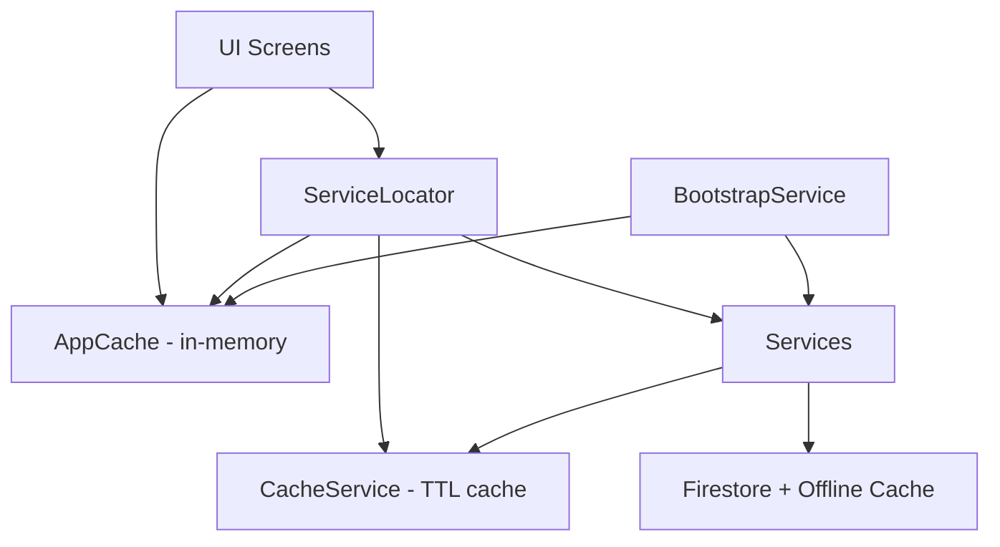
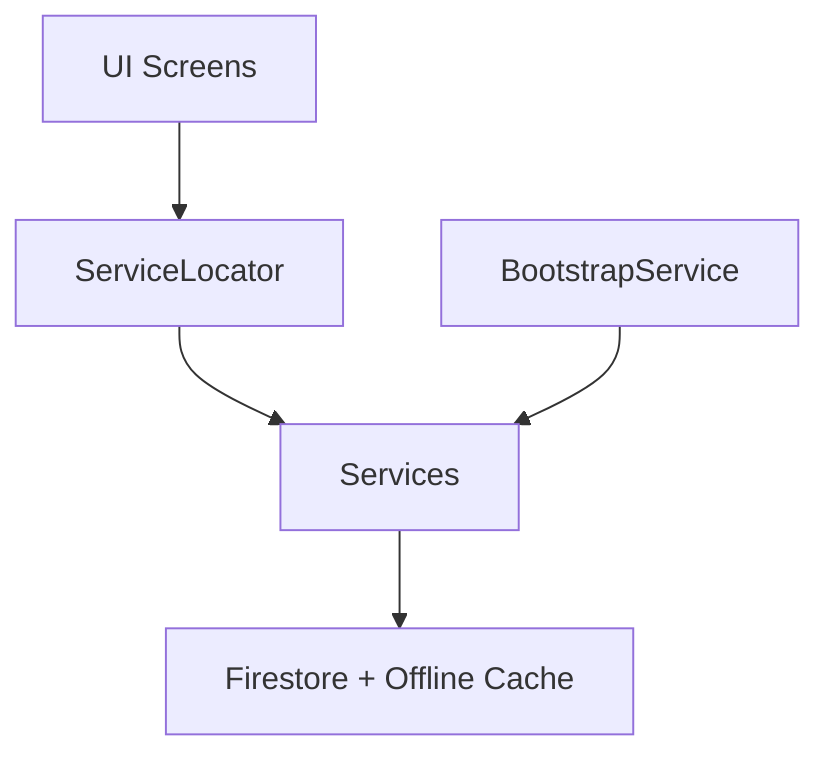

# Tài liệu Thiết kế: Xóa lớp Cache tùy chỉnh

## Tổng quan

Thiết kế này mô tả cách loại bỏ hai lớp cache tùy chỉnh (CacheService và AppCache) khỏi ứng dụng Vintage Ledger. Firestore persistence đã được bật sẵn với dung lượng không giới hạn, nên các lớp cache tùy chỉnh là dư thừa. Thay đổi chính là: xóa các file cache, cập nhật ServiceLocator, sửa BootstrapService, và chuyển tất cả các điểm đọc dữ liệu từ `sl.cache.*` sang gọi trực tiếp service tương ứng.

Lưu ý quan trọng: Tất cả các lớp cache sẽ bị loại bỏ, bao gồm cả cache nội bộ (`_cache` field) trong CategoryService, BudgetService, và SettingService. Firestore persistence (`persistenceEnabled: true`, `cacheSizeBytes: CACHE_SIZE_UNLIMITED`) sẽ là cơ chế cache duy nhất. Firestore repository đã hỗ trợ `useCache: true` (đọc từ `Source.cache`) nên dữ liệu offline vẫn khả dụng.

## Kiến trúc

### Trước khi thay đổi



### Sau khi thay đổi



### Quyết định thiết kế

1. **Không thay thế cache bằng cơ chế khác**: Firestore persistence đã đủ. Repository layer đã hỗ trợ `useCache: true` để đọc từ Firestore local cache.
2. **Các màn hình UI gọi service trực tiếp**: Thay vì đọc từ `sl.cache`, UI sẽ gọi service methods. Services gọi repository, repository gọi Firestore (có offline cache).
3. **BootstrapService đơn giản hóa**: Bước `_runData()` sẽ chỉ giữ lại logic cần thiết (preload FeedHelper names), không còn nạp dữ liệu vào AppCache.
4. **AccountService đơn giản hóa**: Xóa cả CacheService lookup lẫn `_accountCache` map. Gọi Firestore trực tiếp (được hỗ trợ bởi offline cache).
5. **Service-level cache loại bỏ**: Xóa `_cache` field và logic liên quan trong CategoryService, BudgetService, SettingService. Mỗi lần gọi sẽ đọc từ Firestore (local cache hoặc server).

## Thành phần và Giao diện

### Các file bị xóa

| File | Lý do |
|------|-------|
| `lib/core/cache/cache_service.dart` | Lớp cache TTL không còn cần thiết |
| `lib/core/app_cache.dart` | Lớp lưu trữ in-memory không còn cần thiết |

### Các file bị sửa đổi

| File | Thay đổi |
|------|----------|
| `lib/core/service_locator.dart` | Xóa `cache` và `cacheService` fields, xóa imports |
| `lib/core/bootstrap/bootstrap_service.dart` | Đơn giản hóa `_runSettings()` và `_runData()` |
| `lib/features/account/services/account_service.dart` | Xóa CacheService usage, xóa `_accountCache` |
| `lib/features/category/services/category_service.dart` | Xóa `_cache` field và logic cache nội bộ |
| `lib/features/budget/services/budget_service.dart` | Xóa `_cache` field và `_invalidateCache()` |
| `lib/features/settings/services/setting_service.dart` | Xóa `_cache` field, `_ensureCache()`, `clearCache()` |
| `lib/features/settings/screens/setting_screen.dart` | Xóa `sl.cache.clear()` và `sl.settingService.clearCache()` calls |
| `lib/features/account/screens/account_picker_screen.dart` | Xóa `sl.cache.clear()` |
| `lib/features/home/screens/home_screen.dart` | Thay `sl.cache.*` bằng service calls |
| `lib/features/transaction/screens/transaction_list_screen.dart` | Thay `sl.cache.*` bằng service calls |
| `lib/features/transaction/screens/transaction_form_screen.dart` | Thay `sl.cache.*` bằng service calls |
| `lib/features/transaction/services/transaction_service.dart` | Thay `sl.cache.walletNameMap` và `sl.cache.currentAccount` |
| `lib/features/quick_add/quick_add_bar.dart` | Thay `sl.cache.categories` bằng service call |
| `lib/features/category/screens/category_list_screen.dart` | Thay `sl.cache.categories` bằng service call |
| `lib/features/recurring/screens/recurring_list_screen.dart` | Thay `sl.cache.categories` bằng service call |
| `lib/features/recurring/screens/recurring_form_screen.dart` | Thay `sl.cache.categories` bằng service call |
| `lib/features/wallet/screens/wallet_detail_screen.dart` | Thay `sl.cache.*` bằng service calls |
| `test/performance/firebase_optimization_test.dart` | Xóa CacheService tests |

### Chi tiết thay đổi từng thành phần

#### ServiceLocator

```dart
// TRƯỚC
class ServiceLocator {
  final cache = AppCache();
  final cacheService = CacheService();
  // ...other services
}

// SAU
class ServiceLocator {
  // cache và cacheService đã bị xóa
  // ...other services giữ nguyên
}
```

#### AccountService.getAccount()

```dart
// TRƯỚC
Future<Account?> getAccount(String accountId) async {
  final cacheKey = CacheService.accountKey(accountId);
  final cached = sl.cacheService.get<Account>(cacheKey);
  if (cached != null) return cached;
  if (_accountCache.containsKey(accountId)) { ... }
  // fetch from Firestore, store in both caches
}

// SAU
Future<Account?> getAccount(String accountId) async {
  final doc = await _accounts.doc(accountId).get();
  if (!doc.exists) return null;
  return Account.fromMap(doc.id, doc.data() as Map<String, dynamic>);
}
```

#### AccountService.getMemberProfiles()

```dart
// TRƯỚC
Future<List<Map<String, dynamic>>> getMemberProfiles(List<String> memberIds) async {
  final cacheKey = CacheService.memberProfilesKey(memberIds.join(','));
  final cached = sl.cacheService.get<List<Map<String, dynamic>>>(cacheKey);
  if (cached != null) return cached;
  // fetch from Firestore, cache result
}

// SAU
Future<List<Map<String, dynamic>>> getMemberProfiles(List<String> memberIds) async {
  if (memberIds.isEmpty) return [];
  final userRefs = memberIds.map((id) => _users.doc(id)).toList();
  final docs = await Future.wait(userRefs.map((ref) => ref.get()));
  ReadCounter.trackBatchRead('getMemberProfiles', ['users'], memberIds.length);
  // build results without caching
}
```

#### BootstrapService._runData()

```dart
// TRƯỚC
Future<void> _runData() async {
  // fetch categories, account, wallets
  sl.cache.setCategories(categories);
  sl.cache.setWallets(wallets);
  sl.cache.currentAccount = account;
  sl.cache.memberProfiles = profiles;
}

// SAU
Future<void> _runData() async {
  final accountId = sl.appState.currentAccountId;
  if (accountId.isEmpty) return;
  // Preload FeedHelper names nếu có nhiều thành viên
  final account = await sl.accountService.getAccount(accountId);
  if (account != null) {
    final memberIds = account.memberIds;
    if (memberIds.length > 1) {
      await FeedHelper.preloadNames(memberIds);
    }
  }
}
```

#### BootstrapService._runSettings()

```dart
// TRƯỚC
Future<Map<String, String?>> _runSettings() async {
  final locale = await sl.settingService.getLocale();
  final lastWalletId = await sl.settingService.getLastWalletId();
  sl.cache.lastWalletId = lastWalletId;
  return {'locale': locale, 'lastWalletId': lastWalletId};
}

// SAU
Future<Map<String, String?>> _runSettings() async {
  final locale = await sl.settingService.getLocale();
  return {'locale': locale};
}
```

#### UI Screens — Pattern chuyển đổi

Mỗi màn hình UI cần thay thế truy cập `sl.cache.*` bằng service call. Pattern chung:

```dart
// TRƯỚC (đồng bộ, đọc từ cache)
_categories = sl.cache.categories;
_categoryNameMap = sl.cache.categoryNameMap;

// SAU (bất đồng bộ, gọi service)
_categories = await sl.categoryService.getCategories();
_categoryNameMap = {for (var c in _categories) if (c.id != null) c.id!: c.name};
```

Đối với `lastWalletId`:
```dart
// TRƯỚC
_defaultWalletId = sl.cache.lastWalletId;

// SAU
_defaultWalletId = await sl.settingService.getLastWalletId();
```

Đối với `currentAccount` và `memberProfiles`:
```dart
// TRƯỚC
final account = sl.cache.currentAccount;
final members = sl.cache.memberProfiles;

// SAU
final account = await sl.accountService.getAccount(sl.appState.currentAccountId);
final members = (account != null && account.memberIds.length > 1)
    ? await sl.accountService.getMemberProfiles(account.memberIds)
    : <Map<String, dynamic>>[];
```

Đối với `walletNameMap` trong TransactionService:
```dart
// TRƯỚC
final srcName = sl.cache.walletNameMap[sourceWalletId] ?? '';

// SAU — truyền wallet names từ caller hoặc fetch inline
// Vì TransactionService đã có snapshot data, dùng snapshot data trực tiếp
final srcWalletName = (oldSrcSnap.data()?['name'] as String?) ?? '';
```

#### Xóa sl.cache.clear() và sl.settingService.clearCache() calls

Trong `setting_screen.dart` và `account_picker_screen.dart`, xóa dòng `sl.cache.clear()` và `sl.settingService.clearCache()`. Các dòng xóa state khác (`sl.appState`, `FeedHelper.clearCache()`) giữ nguyên.

#### CategoryService — Xóa cache nội bộ

```dart
// TRƯỚC
List<Category>? _cache;

Future<List<Category>> getCategories() async {
  if (_cache != null) return _cache!;
  try {
    _cache = await _repo.getAll(useCache: true);
    if (_cache!.isNotEmpty) {
      _repo.getAll().then((fresh) => _cache = fresh);
      return _cache!;
    }
  } catch (_) {}
  _cache = await _repo.getAll();
  return _cache!;
}

// SAU
Future<List<Category>> getCategories() async {
  return await _repo.getAll();
}
```

Xóa `_cache = null` trong `createCategory()`, `updateCategory()`, `deleteCategory()`.

#### BudgetService — Xóa cache nội bộ

```dart
// TRƯỚC
List<Budget>? _cache;

Future<List<Budget>> getBudgets() async {
  if (_cache != null) return _cache!;
  // ...cache logic
}

void _invalidateCache() => _cache = null;

// SAU
Future<List<Budget>> getBudgets() async {
  return await _repo.getAll();
}
```

Xóa `_invalidateCache()` calls trong `createBudget()`, `updateBudget()`, `deleteBudget()`.

#### SettingService — Xóa cache nội bộ

```dart
// TRƯỚC
Map<String, dynamic>? _cache;

Future<Map<String, dynamic>> _ensureCache() async {
  if (_cache != null) return _cache!;
  // ...load from Firestore
}

void clearCache() => _cache = null;

Future<String> getLocale() async {
  final data = await _ensureCache();
  return data['locale']?.toString() ?? 'vi';
}

Future<void> _write(Map<String, dynamic> data) async {
  _cache ??= {};
  _cache!.addAll(data);
  await _userSettings.set(data, SetOptions(merge: true));
}

// SAU
Future<Map<String, dynamic>> _loadSettings() async {
  try {
    final doc = await _userSettings.get();
    return (doc.exists ? doc.data() as Map<String, dynamic>? : null) ?? {};
  } catch (_) {
    return {};
  }
}

Future<String> getLocale() async {
  final data = await _loadSettings();
  return data['locale']?.toString() ?? 'vi';
}

Future<void> _write(Map<String, dynamic> data) async {
  await _userSettings.set(data, SetOptions(merge: true));
}
```

## Mô hình Dữ liệu

Không có thay đổi về mô hình dữ liệu. Các model (Account, Category, Wallet) giữ nguyên. Chỉ thay đổi cách truy cập dữ liệu (từ cache → từ service/Firestore).


## Thuộc tính Đúng đắn (Correctness Properties)

*Thuộc tính đúng đắn là một đặc điểm hoặc hành vi phải đúng trong mọi trường hợp thực thi hợp lệ của hệ thống — về cơ bản là một phát biểu hình thức về những gì hệ thống phải làm. Các thuộc tính này đóng vai trò cầu nối giữa đặc tả dễ đọc cho con người và đảm bảo tính đúng đắn có thể kiểm chứng bằng máy.*

Phần lớn các yêu cầu trong feature này là về cấu trúc code (xóa file, xóa field, thay đổi import) — không phải thuộc tính runtime. Các thuộc tính testable tập trung vào việc đảm bảo dữ liệu trả về vẫn đúng sau khi xóa cache layer.

Property 1: Account data consistency after cache removal
*For any* valid account ID that exists in Firestore, `AccountService.getAccount()` (sau khi xóa cache) SHALL return an Account object equivalent to the document stored in Firestore.
**Validates: Requirements 1.1**

Property 2: Member profiles consistency after cache removal
*For any* non-empty list of valid user IDs, `AccountService.getMemberProfiles()` (sau khi xóa cache) SHALL return profile maps containing id, name, email, and photo_url for each existing user document in Firestore.
**Validates: Requirements 1.2**

Property 3: Category name map construction equivalence
*For any* list of Category objects with non-null IDs, building a name map as `{for (var c in cats) if (c.id != null) c.id!: c.name}` SHALL produce the same result as the previous `AppCache.setCategories()` method produced in `categoryNameMap`.
**Validates: Requirements 3.6**

## Xử lý Lỗi

Việc xóa cache layer không thay đổi logic xử lý lỗi hiện có. Các trường hợp cần lưu ý:

1. **Firestore offline**: Khi không có mạng, Firestore persistence tự động trả về dữ liệu từ local cache. Không cần xử lý đặc biệt.
2. **Service call failures**: Các service đã có try-catch hiện tại (ví dụ: BootstrapService có timeout và error handling cho từng bước). Giữ nguyên.
3. **Null data**: Các màn hình UI đã xử lý trường hợp dữ liệu null/empty. Khi chuyển từ `sl.cache.currentAccount` (có thể null) sang `await sl.accountService.getAccount(id)` (cũng có thể null), logic null-check giữ nguyên.

## Chiến lược Kiểm thử

### Unit Tests

- Xóa các test liên quan đến CacheService trong `test/performance/firebase_optimization_test.dart` (test cache set/get, cache key generation, cache cleanup, cache reduces reads)
- Giữ nguyên các test về ReadCounter và ListenerManager
- Kiểm tra AccountService.getAccount() trả về đúng dữ liệu (example test)
- Kiểm tra AccountService.getMemberProfiles() trả về đúng dữ liệu (example test)
- Kiểm tra CategoryService.getCategories() gọi repository trực tiếp (example test)
- Kiểm tra SettingService đọc từ Firestore mỗi lần (example test)

### Property-Based Tests

- Sử dụng thư viện `test` của Dart kết hợp với random data generation
- Mỗi property test chạy tối thiểu 100 iterations
- Mỗi test được tag với comment tham chiếu đến property trong design document
- Tag format: **Feature: remove-cache-layer, Property {number}: {property_text}**

### Compilation Verification

- Chạy `flutter analyze` để đảm bảo không có lỗi biên dịch sau khi xóa cache layer
- Chạy `flutter test` để đảm bảo tất cả test còn lại pass
