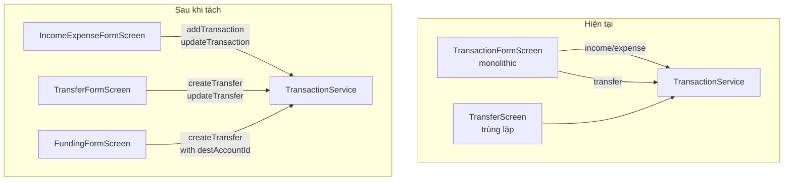
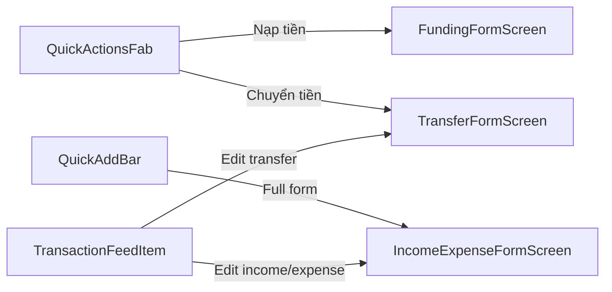

# Design Document: Split Transaction Forms

## Overview

Tách màn hình `TransactionFormScreen` monolithic hiện tại thành 3 màn hình form chuyên biệt:

1. **IncomeExpenseFormScreen** — Thêm/sửa giao dịch thu nhập và chi tiêu (categories, line items, budget, recurring)
2. **TransferFormScreen** — Chuyển tiền giữa các ví (internal + cross-account)
3. **FundingFormScreen** — Nạp tiền từ ví cá nhân vào ví gia đình

Sau khi tách, `TransactionFormScreen` cũ và `TransferScreen` cũ sẽ bị loại bỏ. Tất cả navigation points (QuickActionsFab, QuickAddBar, TransactionFeedItem) sẽ được cập nhật để trỏ đến đúng form mới.

## Architecture

### Chiến lược tách form

Thay vì refactor dần, ta sẽ tạo 3 form mới song song rồi chuyển navigation sang, cuối cùng xóa code cũ. Điều này giảm rủi ro regression vì code cũ vẫn hoạt động cho đến khi form mới sẵn sàng.



### Luồng điều hướng mới



### Shared widgets

Các form mới sẽ tái sử dụng các widget chung đã có:
- `AmountInputField` — nhập số tiền
- `DropdownField` / `SelectionSheet` — chọn wallet, category
- `FormSaveButton` — nút lưu
- `AppScaffold` — layout chung
- `TypeSelector` — chọn income/expense (chỉ dùng trong IncomeExpenseFormScreen)

## Components and Interfaces

### 1. IncomeExpenseFormScreen

**File:** `lib/features/transaction/screens/income_expense_form_screen.dart`

```dart
class IncomeExpenseFormScreen extends StatefulWidget {
  final String? walletId;
  final TransactionWithItems? existing;  // edit mode
  final TransactionWithItems? prefill;   // prefill from QuickAddBar

  const IncomeExpenseFormScreen({
    super.key, this.walletId, this.existing, this.prefill,
  });

  bool get isEdit => existing != null;
}
```

**Trách nhiệm:**
- Quản lý state: `_type` (income/expense only), `_walletId`, `_categoryId`, `_items`, `_date`, `_note`, `_recurring`, `_frequency`, `_budgetStatus`
- Load categories filtered by type, load wallets, load members (for edit)
- Validate: wallet required, category required, line item total ≤ amount
- Auto-fill amount from line item total khi amount = 0
- Tạo RecurringRule nếu toggle recurring bật (chỉ khi tạo mới)
- Gọi `TransactionService.createTransaction()` hoặc `updateTransaction()`
- `Navigator.pop(context, true)` khi save thành công

### 2. TransferFormScreen

**File:** `lib/features/transfer/screens/transfer_form_screen.dart`

```dart
class TransferFormScreen extends StatefulWidget {
  final TransactionWithItems? existing;  // edit mode

  const TransferFormScreen({super.key, this.existing});

  bool get isEdit => existing != null;
}
```

**Trách nhiệm:**
- Quản lý state: `_walletId` (source), `_toWalletId`, `_toAccountId`, `_amount`, `_date`, `_note`
- Load wallets (same account) + cross-account wallets via `_loadAllAccountWallets()`
- Validate: source ≠ destination
- Gọi `TransactionService.createTransfer()` hoặc `updateTransfer()`
- `Navigator.pop(context, true)` khi save thành công

### 3. FundingFormScreen

**File:** `lib/features/transfer/screens/funding_form_screen.dart`

```dart
class FundingFormScreen extends StatefulWidget {
  const FundingFormScreen({super.key});
}
```

**Trách nhiệm:**
- Quản lý state: `_sourceWalletId` (personal), `_destWalletId` (family), `_amount`, `_date`, `_note`
- Load personal wallets + family account wallets
- Gọi `TransactionService.createTransfer()` với `destAccountId` = family account ID
- `Navigator.pop(context, true)` khi save thành công
- Không hỗ trợ edit mode (funding chỉ tạo mới, edit qua TransferFormScreen)

### 4. Navigation Updates

**QuickActionsFab** (`lib/common/widgets/quick_actions_fab.dart`):
- `QuickActionType.funding` → `FundingFormScreen()`
- `QuickActionType.transfer` → `TransferFormScreen()`

**QuickAddBar** (`lib/features/quick_add/quick_add_bar.dart`):
- `_openFullForm()` → `IncomeExpenseFormScreen(walletId:, prefill:)`

**TransactionFeedItem** (`lib/features/transaction/widgets/transaction_feed_item.dart`):
- Check `txn.transaction.type.isTransfer`:
  - `true` → `TransferFormScreen(existing: txn)`
  - `false` → `IncomeExpenseFormScreen(walletId:, existing: txn)`

## Data Models

Không cần thay đổi data models hiện có. Các form mới sẽ sử dụng:

| Model | Dùng bởi | Mục đích |
|-------|----------|----------|
| `TransactionModel` | IncomeExpenseFormScreen | Tạo/sửa giao dịch thu chi |
| `TransactionWithItems` | IncomeExpenseFormScreen | Giao dịch kèm line items |
| `TransactionItemModel` | IncomeExpenseFormScreen | Line items |
| `TransactionType` | IncomeExpenseFormScreen, TransferFormScreen | Phân loại giao dịch |
| `Category` | IncomeExpenseFormScreen | Danh mục thu chi |
| `Wallet` | Tất cả form screens | Chọn ví |
| `BudgetStatus` | IncomeExpenseFormScreen | Kiểm tra ngân sách |
| `RecurringRule` / `Frequency` | IncomeExpenseFormScreen | Giao dịch định kỳ |

### Helper class tái sử dụng

`_AccountWallets` class hiện nằm private trong `TransactionFormScreen` sẽ được extract ra thành shared utility:

```dart
// lib/features/wallet/models/account_wallets.dart
class AccountWallets {
  final String accountId;
  final String accountName;
  final List<Wallet> wallets;
  
  const AccountWallets({
    required this.accountId,
    required this.accountName,
    required this.wallets,
  });
}
```

Class này sẽ được dùng bởi cả `TransferFormScreen` và `FundingFormScreen` để hiển thị cross-account wallet selection.


## Correctness Properties

*A property is a characteristic or behavior that should hold true across all valid executions of a system — essentially, a formal statement about what the system should do. Properties serve as the bridge between human-readable specifications and machine-verifiable correctness guarantees.*

### Property 1: Category filtering by transaction type

*For any* list of categories and any selected TransactionType (income or expense), the category list displayed in IncomeExpenseFormScreen should only contain categories whose type matches the selected TransactionType.

**Validates: Requirements 1.2**

### Property 2: Form population from existing income/expense transaction

*For any* valid TransactionWithItems where the transaction type is income or expense, opening IncomeExpenseFormScreen in edit mode should result in all form fields (amount, walletId, categoryId, date, note, items) matching the values from the existing transaction.

**Validates: Requirements 1.5**

### Property 3: Line items total validation

*For any* list of line items and any main amount where the sum of line item amounts exceeds the main amount, the IncomeExpenseFormScreen should prevent form submission.

**Validates: Requirements 1.7**

### Property 4: Auto-fill amount from line items

*For any* list of line items with a positive total, when the main amount is zero, the IncomeExpenseFormScreen should set the amount to equal the sum of line item amounts.

**Validates: Requirements 1.8**

### Property 5: Source wallet exclusion from destination list

*For any* list of wallets within the same account and any selected source wallet, the destination wallet list in TransferFormScreen should not contain the selected source wallet.

**Validates: Requirements 2.2**

### Property 6: Form population from existing transfer transaction

*For any* valid TransactionWithItems where the transaction type is transferOut, opening TransferFormScreen in edit mode should result in all form fields (amount, sourceWalletId, destWalletId, destAccountId, date, note) matching the values from the existing transaction.

**Validates: Requirements 2.4**

### Property 7: Funding destination wallet filtering

*For any* set of account wallets (personal + family), the destination wallet list in FundingFormScreen should only contain wallets belonging to the family account.

**Validates: Requirements 3.2**

### Property 8: Edit navigation routing by transaction type

*For any* TransactionWithItems, when the user taps to edit, the navigation target should be IncomeExpenseFormScreen when the transaction type is income or expense, and TransferFormScreen when the transaction type is transferOut or transferIn.

**Validates: Requirements 5.2, 5.3**

### Property 9: Required field validation

*For any* form state where a required field (wallet for all forms, category for IncomeExpenseFormScreen) is null or empty, form validation should fail and prevent submission.

**Validates: Requirements 7.1**

## Error Handling

| Tình huống | Xử lý |
|------------|--------|
| Service throw exception khi save | Catch exception, hiển thị `showAppSnackBar` với message lỗi, giữ nguyên form data |
| Wallet list rỗng | Hiển thị form nhưng validation sẽ fail khi submit (wallet required) |
| Category list rỗng | Hiển thị form với category dropdown rỗng, cho phép user tạo category mới qua `_onAddCategory()` |
| Cross-account wallet load fail | Fallback về same-account wallets (logic hiện có trong `_buildToWalletDropdown`) |
| Navigator.pop sau khi widget unmounted | Check `mounted` trước khi gọi Navigator.pop (pattern hiện có) |

## Testing Strategy

### Unit Tests

- Test category filtering logic: given a list of categories, filter by income/expense type
- Test line item total calculation and validation against main amount
- Test auto-fill amount logic
- Test wallet exclusion logic for transfer destination
- Test family wallet filtering logic for funding
- Test navigation routing logic (transaction type → target screen)

### Property-Based Tests

Sử dụng thư viện **`glados`** (Dart property-based testing library) với tối thiểu 100 iterations mỗi property test.

Mỗi property test phải được annotate với comment:
```dart
// Feature: split-transaction-forms, Property N: [property title]
```

| Property | Mô tả | Generator cần thiết |
|----------|--------|---------------------|
| Property 1 | Category filtering | Random list of Category, random TransactionType |
| Property 2 | Income/expense form population | Random TransactionWithItems (income/expense type) |
| Property 3 | Line items total validation | Random list of amounts, random main amount |
| Property 4 | Auto-fill amount | Random list of positive amounts |
| Property 5 | Source wallet exclusion | Random list of Wallet, random selected wallet |
| Property 6 | Transfer form population | Random TransactionWithItems (transfer type) |
| Property 7 | Funding dest wallet filtering | Random list of AccountWallets with mixed account types |
| Property 8 | Edit navigation routing | Random TransactionWithItems with random type |
| Property 9 | Required field validation | Random form state with some null fields |

### Widget Tests

- IncomeExpenseFormScreen renders all expected fields
- TransferFormScreen renders all expected fields
- FundingFormScreen renders all expected fields
- Budget status warning displays when budget is near limit or exceeded
- Error snackbar displays on service failure
