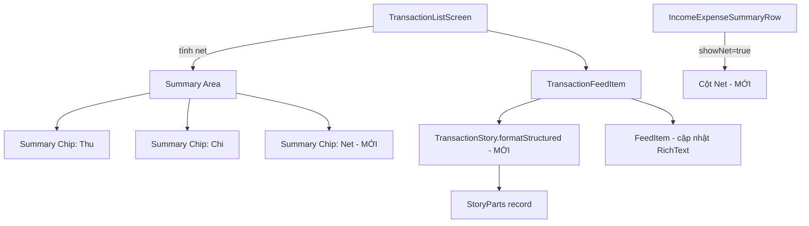

# Design Document: Transaction Summary Net Display

## Overview

Tính năng này bổ sung hiển thị giá trị "Chênh lệch" (Net = Thu - Chi) vào khu vực tổng hợp trên màn hình danh sách giao dịch, đồng thời làm nổi bật tên người thực hiện giao dịch trong danh sách. Thay đổi chính gồm:

1. Thêm Summary_Chip thứ 3 (Net) vào Summary_Area của `TransactionListScreen`
2. Mở rộng `IncomeExpenseSummaryRow` hỗ trợ hiển thị Net tùy chọn
3. Refactor `TransactionStory` trả về structured data để FeedItem render tên người thực hiện với font weight nổi bật
4. Cập nhật `FeedItem` sử dụng `RichText` để bold tên người thực hiện

## Architecture

Thay đổi tập trung vào presentation layer, không ảnh hưởng đến data layer hay business logic:



Logic tính toán thu/chi (`_countsAsIncome`, `_countsAsExpense`) giữ nguyên. Net được tính đơn giản: `totalIncome - totalExpense`.

## Components and Interfaces

### 1. TransactionListScreen - Summary Area (cập nhật)

File: `lib/features/transaction/screens/transaction_list_screen.dart`

Thay đổi trong `build()`:
- Tính thêm `totalNet = totalIncome - totalExpense`
- Thêm Summary_Chip thứ 3 cho Net
- Màu Net: `AppColors.income` nếu dương, `AppColors.expense` nếu âm, `AppColors.textSecondary` nếu bằng 0

```dart
// Trong build():
final totalNet = totalIncome - totalExpense;

// Summary area - thêm chip Net
Row(
  mainAxisAlignment: MainAxisAlignment.spaceEvenly,
  children: [
    _buildSummaryChip(S.of(context, 'income'), totalIncome, AppColors.income, locale),
    _buildSummaryChip(S.of(context, 'expense'), totalExpense, AppColors.expense, locale),
    _buildSummaryChip(
      S.of(context, 'net'),
      totalNet.abs(),
      _netColor(totalNet),
      locale,
      prefix: totalNet > 0 ? '+' : totalNet < 0 ? '-' : '',
    ),
  ],
)
```

Thêm helper method `_netColor`:
```dart
Color _netColor(int net) {
  if (net > 0) return AppColors.income;
  if (net < 0) return AppColors.expense;
  return AppColors.textSecondary;
}
```

Cập nhật `_buildSummaryChip` để hỗ trợ prefix:
```dart
Widget _buildSummaryChip(String label, int amount, Color color, String locale, {String prefix = ''}) {
  return Column(
    children: [
      Text(label, style: AppTextStyles.caption),
      const SizedBox(height: AppSpacing.xs),
      Text(
        '$prefix${AmountFormatter.formatCompactCurrency(amount, locale)}',
        style: TextStyle(fontSize: 16, fontWeight: FontWeight.w600, color: color),
      ),
    ],
  );
}
```

### 2. IncomeExpenseSummaryRow (cập nhật)

File: `lib/common/widgets/income_expense_summary_row.dart`

Thêm parameter `showNet` (default `false`) và optional `netLabel`:

```dart
class IncomeExpenseSummaryRow extends StatelessWidget {
  final int income;
  final int expense;
  final String? incomeLabel;
  final String? expenseLabel;
  final bool showNet;       // MỚI
  final String? netLabel;   // MỚI

  // ...

  @override
  Widget build(BuildContext context) {
    final net = income - expense;
    return Row(
      children: [
        Expanded(child: _incomeColumn(context)),
        Container(width: 1, height: 40, color: AppColors.divider),
        Expanded(child: _expenseColumn(context)),
        if (showNet) ...[
          Container(width: 1, height: 40, color: AppColors.divider),
          Expanded(child: _netColumn(context, net)),
        ],
      ],
    );
  }
}
```

Màu Net column: `AppColors.income` nếu dương, `AppColors.expense` nếu âm, `AppColors.textSecondary` nếu bằng 0.

### 3. TransactionStory - Structured Output (mới)

File: `lib/utils/transaction_story.dart`

Thêm record `StoryParts` và method `formatStructured`:

```dart
/// Structured story output cho RichText rendering
typedef StoryParts = ({String? actorName, String rest});

class TransactionStory {
  // Giữ nguyên format() cho backward compatibility

  /// Trả về structured data để FeedItem render tên actor với style riêng
  static StoryParts formatStructured({
    required String actorName,
    required String categoryName,
    required int amount,
    required TransactionType type,
    required String locale,
    String? note,
    String? walletName,
    String? toWalletName,
    String? toAccountName,
  }) {
    final amountStr = AmountFormatter.formatCompactCurrency(amount, locale);

    if (type.isTransferOut) {
      final dest = toWalletName ?? '?';
      final prefix = toAccountName != null ? '$toAccountName / ' : '';
      return (actorName: actorName, rest: ' chuyển $amountStr → $prefix$dest 💸');
    }
    if (type.isTransferIn) {
      final src = toWalletName ?? '?';
      final prefix = toAccountName != null ? '$toAccountName / ' : '';
      return (actorName: null, rest: 'Nhận $amountStr từ $prefix$src 💸');
    }

    final emoji = getCategoryEmoji(categoryName);
    final label = note != null && note.isNotEmpty ? note : categoryName.toLowerCase();
    return (actorName: actorName, rest: ' $label $amountStr $emoji');
  }
}
```

Lưu ý: `transferIn` không có actorName ở đầu câu (câu bắt đầu bằng "Nhận"), nên `actorName` trả về `null`.

### 4. FeedItem - RichText (cập nhật)

File: `lib/features/feed/widgets/feed_item.dart`

Thêm optional parameters cho structured text:

```dart
class FeedItem extends StatelessWidget {
  final String actorName;
  final String text;
  final String? boldPrefix;  // MỚI - phần tên cần bold
  final String? textAfterPrefix; // MỚI - phần còn lại
  // ...
}
```

Trong `build()`, nếu `boldPrefix` != null, dùng `RichText`:

```dart
boldPrefix != null
  ? RichText(
      text: TextSpan(
        children: [
          TextSpan(text: boldPrefix, style: AppTextStyles.body.copyWith(fontWeight: FontWeight.w600)),
          TextSpan(text: textAfterPrefix ?? '', style: AppTextStyles.body),
        ],
      ),
    )
  : Text(text, style: AppTextStyles.body),
```

### 5. TransactionFeedItem (cập nhật)

File: `lib/features/transaction/widgets/transaction_feed_item.dart`

Chuyển từ `TransactionStory.format()` sang `TransactionStory.formatStructured()`:

```dart
final parts = TransactionStory.formatStructured(
  actorName: actor,
  categoryName: categoryName,
  // ... same params
);

FeedItem(
  actorName: actor,
  text: parts.actorName != null ? '${parts.actorName}${parts.rest}' : parts.rest,
  boldPrefix: parts.actorName,
  textAfterPrefix: parts.rest,
  // ...
)
```

## Data Models

### StoryParts (Dart record)

```dart
typedef StoryParts = ({String? actorName, String rest});
```

- `actorName`: Tên người thực hiện, `null` nếu tên không xuất hiện ở đầu câu (vd: transferIn)
- `rest`: Phần còn lại của story text (bao gồm khoảng trắng đầu nếu có)

Không có thay đổi data model nào khác. Tất cả dữ liệu giao dịch, ví, danh mục giữ nguyên.

### Net calculation (pure function)

```dart
int calculateNet(int totalIncome, int totalExpense) => totalIncome - totalExpense;
```

Đây là phép tính đơn giản, nhưng tính chất bất biến `net + expense == income` cần được đảm bảo.


## Correctness Properties

*A property is a characteristic or behavior that should hold true across all valid executions of a system — essentially, a formal statement about what the system should do. Properties serve as the bridge between human-readable specifications and machine-verifiable correctness guarantees.*

Dựa trên phân tích acceptance criteria, có 3 correctness properties cần kiểm chứng:

### Property 1: Net color mapping

*For any* integer value `net`, hàm `_netColor(net)` SHALL trả về:
- `AppColors.income` nếu `net > 0`
- `AppColors.expense` nếu `net < 0`
- `AppColors.textSecondary` nếu `net == 0`

**Validates: Requirements 1.3, 1.4, 1.5, 2.4, 2.5, 2.6**

### Property 2: Net invariant (net + expense == income)

*For any* danh sách giao dịch hợp lệ, khi tính `totalIncome`, `totalExpense`, và `totalNet` sử dụng cùng logic phân loại (`_countsAsIncome`, `_countsAsExpense`), thì `totalNet + totalExpense == totalIncome` luôn đúng.

Đây là invariant property: bất kể danh sách giao dịch nào (rỗng, chỉ thu, chỉ chi, hỗn hợp, có transfer), đẳng thức này phải luôn thỏa mãn.

**Validates: Requirements 1.2, 4.1, 4.2, 4.3, 4.4**

### Property 3: TransactionStory structured/plain consistency (round-trip)

*For any* giao dịch hợp lệ với bất kỳ loại nào (income, expense, transferOut, transferIn), kết quả của `TransactionStory.formatStructured()` khi ghép lại (`actorName + rest` hoặc `rest` nếu actorName null) SHALL bằng đúng kết quả của `TransactionStory.format()` với cùng tham số đầu vào.

Đây là round-trip property đảm bảo tính nhất quán giữa 2 phương thức.

**Validates: Requirements 5.2, 5.3**

## Error Handling

Tính năng này chủ yếu là UI display, ít có error case phức tạp:

1. **Danh sách giao dịch rỗng**: `totalIncome = 0`, `totalExpense = 0`, `net = 0`. Hiển thị bình thường với giá trị 0 và màu `textSecondary`.

2. **Giá trị rất lớn**: `AmountFormatter.formatCompactCurrency` đã xử lý compact format (k, tr, tỷ). Không cần xử lý thêm.

3. **actorName rỗng**: `TransactionStory.formatStructured` trả về `actorName` là chuỗi rỗng, FeedItem vẫn render đúng (TextSpan rỗng không ảnh hưởng layout).

4. **transferIn không có actorName ở đầu**: `formatStructured` trả về `actorName: null`, FeedItem fallback về plain Text thay vì RichText.

## Testing Strategy

### Property-Based Tests (sử dụng `dart_check` hoặc `glados` package)

Mỗi property test chạy tối thiểu 100 iterations với random input.

1. **Property 1 test**: Generate random integers (bao gồm dương, âm, 0, giá trị lớn, giá trị nhỏ), verify `_netColor` trả về đúng màu.
   - Tag: **Feature: transaction-summary-net-display, Property 1: Net color mapping**

2. **Property 2 test**: Generate random lists of transactions (mix income, expense, transferIn, transferOut), tính income/expense/net, verify `net + expense == income`.
   - Tag: **Feature: transaction-summary-net-display, Property 2: Net invariant (net + expense == income)**

3. **Property 3 test**: Generate random transaction parameters (actorName, categoryName, amount, type, locale, note, walletName, toWalletName, toAccountName), verify `formatStructured` ghép lại bằng `format`.
   - Tag: **Feature: transaction-summary-net-display, Property 3: TransactionStory structured/plain consistency**

### Unit Tests

- Test `_buildSummaryChip` với prefix '+', '-', '' cho các trường hợp net dương, âm, 0
- Test `IncomeExpenseSummaryRow` với `showNet: true` và `showNet: false`
- Test `FeedItem` render RichText khi có `boldPrefix`
- Test `TransactionStory.formatStructured` cho từng loại giao dịch cụ thể (income, expense, transferOut, transferIn)

### Testing Library

- Property-based testing: `glados` package (Dart PBT library, hỗ trợ shrinking và arbitrary generation)
- Unit testing: `flutter_test` (built-in)
- Widget testing: `flutter_test` với `WidgetTester`
